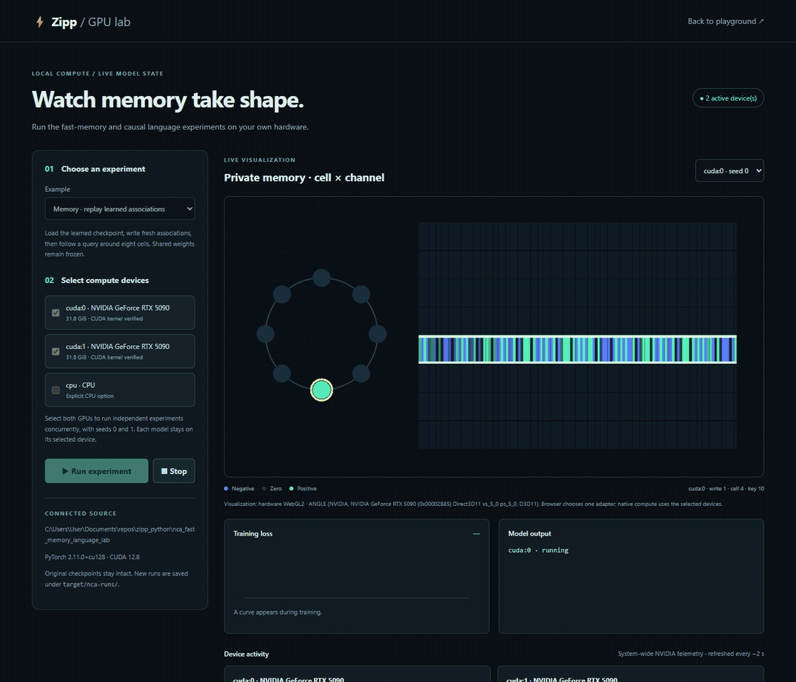
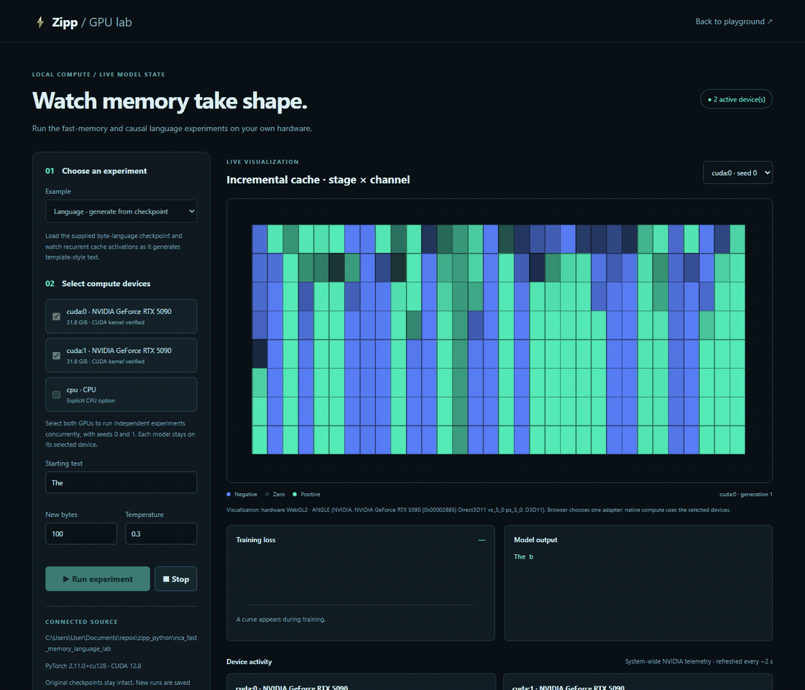
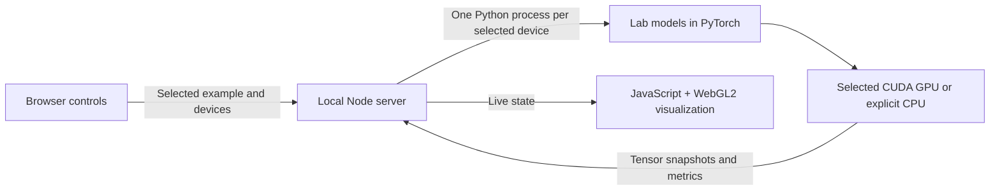
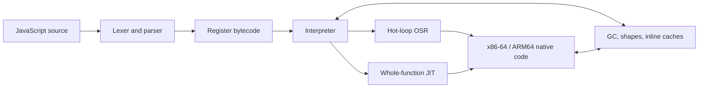

<p align="center">
  
</p>

<h1 align="center">Zipp: Python, JavaScript &amp; GPU experiments</h1>

<p align="center">
  <strong>A Rust engine, a browser playground, and a local GPU research lab.</strong>
</p>

<p align="center">
  <a href="#start-the-local-gpu-lab"><strong>Run the GPU lab</strong></a> ·
  <a href="#gpu-computing-from-javascript-and-python"><strong>Write GPU code</strong></a> ·
  <a href="DOC.md"><strong>Read the docs</strong></a>
</p>

<p align="center">
  <a href="#quick-start">Quick start</a> ·
  <a href="#what-runs-where">What runs where</a> ·
  <a href="#what-the-nca-lab-is-showing">Live model state</a> ·
  <a href="#performance-measured-honestly">Performance</a> ·
  <a href="#correctness-and-language-coverage">Language support</a> ·
  <a href="#choose-the-right-execution-profile">Security</a> ·
  <a href="#reproduce-and-contribute">Contribute</a>
</p>

This repository brings together **Zipp's Rust JavaScript engine**, an
**experimental Python frontend**, a **WebAssembly playground**, and GPU compute
examples for the browser and native PyTorch. Write programs, inspect their
outputs, and watch real model state change while experiments run on your hardware.

The Python frontend compiles into Zipp's own VM. The browser GPU runtime is
JavaScript that executes float32 graphs through WebGPU or WebGL2. The native
NCA lab loads the sibling research project's models into ordinary CPython and
PyTorch/CUDA, then streams their state into a JavaScript/WebGL2 visualization.
These execution paths have different capabilities, described below.

## What runs where

| What you want to do | Where your code runs | Where the numerical or drawing work runs |
|---|---|---|
| Run JavaScript scripts or embed Zipp | Native Rust VM/JIT, or Zipp's WebAssembly build | CPU; host APIs are supplied by the embedding application |
| Run Python projects in Zipp | Experimental Python frontend on the same VM | CPU, including the bundled `torch` subset |
| Submit a Python `zipp_gpu` graph from the playground | Python in the WASM Worker; JavaScript handles the graph | WebGPU compute shaders or WebGL2 fragment shaders; visible CPU fallback in `auto` mode |
| Use GPU graphs from browser JavaScript | An ordinary browser ES module or Worker | The same GPU runtime, without requiring Python or the Zipp VM |
| Draw a custom browser visualization | Browser JavaScript with a canvas | WebGL/WebGL2 through the browser-selected adapter |
| Train/replay the native NCA models | Local CPython with full PyTorch | Selected CUDA device(s), or explicitly selected CPU; WebGL2 renders tensor snapshots in the browser |

**GPU support does not automatically move all Python or JavaScript onto a GPU.**
The graph API executes its supported operations on the selected backend. Native
NCA examples explicitly place models and tensors on their selected CUDA device.
The ordinary playground's `ui` drawing API uses a 2D canvas; the NCA heatmap and
ring use a separate WebGL2 renderer.

## See Zipp in action

**Python running on Zipp WASM, with Game of Life on the GPU.** This is a recording
of the actual folder playground: the Python source is compiled and executed by
Zipp's WebAssembly VM. Each Life update submits a float32 graph to JavaScript's
WebGL2 host; its named outputs return to Python for drawing.

[](landing/public/demos/python-wasm-flow.svg)

[](landing/public/demos/python-life.gif)

**[Open the full project playground](https://zipp.org/playground/)** ·
[Static screenshot](landing/public/demos/python-playground.png) ·
[Python example source](examples/python/gpu/main.py)

<details>
<summary>Inspect the Python editor, canvas, WASM status and GPU output in a still screenshot</summary>


</details>

**Native NCA recordings: real PyTorch/CUDA models, rendered through WebGL2.**
These use the separate local runner, rather than executing full PyTorch inside
WASM. Two RTX 5090s run independent experiments; the browser displays one run at
a time. The full [NCA explanation](#what-the-nca-lab-is-showing) covers the state,
model limits, device selection and saved outputs.

| Acquiring and querying private memory | Generating text from recurrent byte state |
|---|---|
| [](landing/public/demos/nca-memory.gif) | [](landing/public/demos/nca-language.gif) |
| [Static memory view](landing/public/demos/nca-memory.png) | [Static language view](landing/public/demos/nca-language.png) |

These are actual local captures, not simulated output or GPU benchmarks. Click a
GIF for the full view; they autoplay and loop continuously. Still images are
available for readers who prefer less motion. The landing page includes a pause control and honors reduced-motion
preferences. [Capture provenance](landing/public/demos/provenance.json) records
the engine, devices, source hashes and recording durations. Reproduce the media
with `python crates/zipp-wasm/playground/capture-demos.py` (Chrome, Python
Playwright, ffmpeg, the WASM build and local CUDA lab required).

## Why Zipp

| Fast to start | Modern JavaScript | Ready to embed |
|---|---|---|
| **7.4 ms** median process launch in the canonical capture. No snapshot to load. | **99.997%** of core Test262 executions: **95,939 / 95,942**. | A native CLI, a Rust embedding API, and a browser WebAssembly runtime. |

- **Explore the whole engine.** The lexer, parser, register VM, GC, inline caches
  and JITs live together in this repository.
- **Choose how to run it.** Use the native JIT for trusted programs, a browser
  Worker for WebAssembly, or the separately built hardened native runner.
- **Use Python and JavaScript.** Explore the experimental Python frontend or
  call the browser's GPU graph runtime directly from JavaScript.
- **Watch actual model state.** Train and replay the NCA examples on selected
  local GPUs, with live memory matrices, recurrent activations, loss and text.
- **See the evidence.** Benchmarks include exact-output checks, raw results,
  confidence intervals and the workloads that still need work.

The [performance results](#performance-measured-honestly) and
[language coverage](#correctness-and-language-coverage) explain the measurements
and their scope.

## Quick start

### Start the local GPU lab

For browser-only experiments, the landing page embeds the complete project
playground and also exposes it at **[`/playground`](https://zipp.org/playground/)**.
It supports folders, loose files, Python/JavaScript samples, entry files,
arguments, editing, console/canvas output and the GPU selector. Selected files
are read locally into the browser's virtual filesystem; they are not uploaded
to an execution server. Full native PyTorch/CUDA runs use the local setup below.

Use this checkout alongside the separate research project:

```text
parent-folder/
  zipp.org/                       # this repository; its folder name can differ
  nca_fast_memory_language_lab/    # source, toy text and trained checkpoints
```

You need Node.js and Python with a suitable PyTorch installation. For CUDA,
install the build recommended by the [PyTorch installer](https://pytorch.org/get-started/locally/)
for your hardware. The research folder is a separate local dependency; cloning
this repository does not download its model files.

From this repository's root:

```powershell
node crates/zipp-wasm/playground/serve.cjs
```

On Windows you can instead double-click **[`START-GPU-LAB.cmd`](START-GPU-LAB.cmd)**.
Open the printed **native GPU lab** URL (normally
`http://127.0.0.1:8765/crates/zipp-wasm/playground/nca.html`). If that port is
occupied, the launcher tries another and prints the actual address.

Choose **Memory · replay learned associations**, select a CUDA device, and
press **Run experiment**. Select both GPUs for independent concurrent runs;
use the view selector to inspect each one. **Stop** ends the active run group.
The native lab does not require compiling Zipp or building its WASM package.
See [configuration and prerequisites](crates/zipp-wasm/playground/README.md#native-nca-lab-your-gpus-and-live-model-state)
for `NCA_PYTHON`, `NCA_LAB_DIR`, device checks and troubleshooting.

To explore browser GPU graphs without the separate NCA project, start the same
server and open `http://127.0.0.1:8765/crates/zipp-wasm/gpu-lab/demo/` (adjust the
port to the printed address). That standalone graph demo needs no PyTorch or
Zipp build. The Python/JavaScript **VM playground** additionally needs the
[Python-enabled WASM build](crates/zipp-wasm/playground/README.md).

### Run the JavaScript engine

The published [`v0.0.17` release](https://github.com/f2i-com/zipp.org/releases/tag/v0.0.17)
provides x86-64 binaries and a browser WebAssembly package for the JavaScript
engine. Those release downloads predate this checkout's Python and native GPU
lab additions; build this repository for its current engine features.

Save this as `app.js`, then choose your platform below:

```js
const greet = name => `Hello, ${name}!`;
console.log(greet("Zipp"));
```

Building an application? Start with the [Rust embedding guide](DOC.md#embedding),
the [browser example](#embed-zipp-webassembly-in-a-web-app), or the
[execution profiles](#choose-the-right-execution-profile).

### Windows

<details>
<summary><strong>Download and run with PowerShell</strong></summary>

Download, extract, and run the native Windows executable from PowerShell:

```powershell
$version = '0.0.17'
$archive = "zipp-$version-x86_64-pc-windows-msvc.zip"
Invoke-WebRequest "https://github.com/f2i-com/zipp.org/releases/download/v$version/$archive" -OutFile $archive
Expand-Archive -LiteralPath $archive -DestinationPath .

& ".\zipp-$version-x86_64-pc-windows-msvc\zipp.exe" js .\app.js
```

Use `mjs` instead of `js` for an ES module entry, including top-level `await`.

</details>

### Linux

<details>
<summary><strong>Download and run from your shell</strong></summary>

Download, extract, and run the native Linux binary:

```sh
version=0.0.17
archive="zipp-$version-x86_64-unknown-linux-gnu.tar.gz"
curl -fLO "https://github.com/f2i-com/zipp.org/releases/download/v$version/$archive"
tar -xzf "$archive"

"./zipp-$version-x86_64-unknown-linux-gnu/zipp" js ./app.js
```

The archive preserves the executable bit. If another tool removes it, restore it
with `chmod +x zipp-0.0.17-x86_64-unknown-linux-gnu/zipp`.

</details>

### Build from source

<details>
<summary><strong>Clone the repository and build with Cargo</strong></summary>

Install stable Rust and its platform toolchain (MSVC Build Tools on Windows, or
a C compiler and linker on Linux). On Windows, run this in PowerShell:

```powershell
git clone https://github.com/f2i-com/zipp.org.git zipp
Set-Location zipp
cargo build --locked --release

.\target\release\zipp.exe js .\app.js
```

On Linux:

```sh
git clone https://github.com/f2i-com/zipp.org.git zipp
cd zipp
cargo build --locked --release

./target/release/zipp js app.js
./target/release/zipp mjs app.mjs   # ES module entry, including top-level await
```

A release build uses fat LTO and one codegen unit, so the final link is
deliberately slower than a development build. The resulting executable has no
runtime data-file dependency.

</details>

### Run Python (experimental)

The CLI also runs Python: Zipp's own Python 3 implementation, with the
source lowered straight to the engine's register bytecode (no transpilation
to JavaScript and no second interpreter), so a `.py` file runs on the same VM.
Save this as `fib.py`:

```python
def fib(n):
    a = 0
    b = 1
    for i in range(n):
        a, b = b, a + b
    return a

print(fib(30))
```

```sh
zipp py fib.py                 # 832040
zipp run fib.py                # frontend chosen by extension, shebang or directive
zipp run --lang=python -       # from standard input
```

Classes (including metaclasses, descriptors and `__slots__`), exceptions
with full tracebacks, generators, closures, comprehensions, `match`
statements, f-strings, the builtin types and a set of standard-library
modules (`math`, `json`, `re`, `collections`, `itertools`, `functools`,
`dataclasses`, `enum`, `contextlib`, `typing`, `struct`, `hashlib`, ...)
all work; `async` does not yet. Semantics are checked
differentially against CPython: `tests/python_corpus/*.py` must print
exactly what CPython prints.

A folder runs as a project: `zipp py examples/python/project` runs its
`main.py`, and `zipp py lab/train.py --steps 20` runs one script of a
folder with arguments. Every file of the folder (subfolders included, up to
8 MiB each and 64 MiB in total) is loaded into the program's virtual
filesystem, so `open()`, `os`, `os.path`, `pathlib` and `json.load` see the
project's data; `.py` files are modules and packages by folder
(`legacy/fast_memory.py` is `legacy.fast_memory`, with or without an
`__init__.py`); `sys.argv` carries the arguments; and files the program
writes are copied back under the folder when it finishes. A `test_*.py`
entry runs its tests through the bundled `pytest` subset. The bundled
library also includes a `torch` subset (tensors over typed arrays with
reverse-mode autograd, `nn`, `nn.functional`, `optim`, `save`/`load` in
PyTorch's checkpoint format) that runs on the engine's CPU kernels, so a
small research lab written for PyTorch trains and evaluates unchanged; it
is not GPU-backed and is many times slower than PyTorch. The scope
matrix, limits and the bytecode design are in
[docs/PYTHON_FRONTEND_EXPERIMENT.md](docs/PYTHON_FRONTEND_EXPERIMENT.md). The
feature is on by default in the CLI (`--no-default-features` builds the
JavaScript-only binary) and off by default in the `zipp-vm` library and the
WebAssembly package, which offers it as a
[separate build variant](crates/zipp-wasm/README.md#build-variants-javascript-only-or-javascript-and-python).

Python programs can also compute on the GPU in the browser: the bundled
`zipp_gpu` library records a float32 graph (`+`, `*`, `@`, `relu`, `sum`,
a Conway-life step) and `submit`s it, and the host runs it through WebGPU,
WebGL2, compiled WebAssembly kernels or a JavaScript reference, calling the
program back with the outputs; natively the same code evaluates on the CPU.
See [crates/zipp-wasm/README.md](crates/zipp-wasm/README.md#gpu-compute-for-python-programs).

There is also a local [playground](crates/zipp-wasm/playground/README.md)
that runs a folder of Python or JavaScript files on the WebAssembly engine:
open or drop a whole project folder (subfolders, data files and binary
checkpoints included), browse it in a file tree, pick any script as the
entry, give it arguments, and run it in the browser; files the program
writes show up in the tree. It has an editor, a console and a canvas the
program draws on through a small `ui` API (`draw`/`update`/`on_click`/
`on_key` hooks for animation and input), and a GPU sample that steps life
on the compute backend every frame:

```sh
cd crates/zipp-wasm && ./build-variants.sh all && node playground/serve.cjs
```

The playground's **NCA lab · native GPUs** page also runs the sibling
`nca_fast_memory_language_lab` models using local PyTorch/CUDA. Choose one or
multiple GPUs for independent memory / language experiments, with live WebGL2
tensor views, loss curves, generated text and NVIDIA telemetry. From the repository
root, `START-GPU-LAB.cmd` starts the local server; the native lab needs no WASM build.
See [GPU lab setup and examples](crates/zipp-wasm/playground/README.md#native-nca-lab-your-gpus-and-live-model-state).

## GPU computing from JavaScript and Python

**Yes: JavaScript can use WebGL directly.** [WebGL is a browser JavaScript API](https://developer.mozilla.org/en-US/docs/Web/API/WebGL_API),
and this project's [WebGL2 graph backend](crates/zipp-wasm/gpu-lab/src/backends/webgl2.mjs),
[WebGPU graph backend](crates/zipp-wasm/gpu-lab/src/backends/webgpu.mjs), and
[NCA renderer](crates/zipp-wasm/playground/nca-renderer.mjs) are written in
JavaScript. Python is one way to author work for that runtime.

### Browser JavaScript: run a GPU graph

Save the following as `gpu-example.html` in the repository root, start the local
server above, and open `http://127.0.0.1:8765/gpu-example.html` (using the printed
port). It runs directly in the browser and requires no Python or Zipp build.

```html
<!doctype html>
<meta charset="utf-8">
<title>JavaScript GPU graph</title>
<pre id="output">Running a WebGL2 graph…</pre>
<script type="module">
import { createRuntime } from "/crates/zipp-wasm/gpu-lab/src/runtime.mjs";

const output = document.getElementById("output");
let runtime;
try {
  runtime = await createRuntime({ backend: "webgl2" });
  const result = await runtime.execute({
    version: 1,
    nodes: [
      { id: 0, op: "input", shape: [3], data: [-2, 3, 4] },
      { id: 1, op: "input", shape: [3], data: [10, 20, 30] },
      { id: 2, op: "mul", a: 0, b: 1 },
      { id: 3, op: "relu", a: 2 }
    ],
    outputs: [{ name: "values", id: 3 }]
  });
  output.textContent = JSON.stringify({
    backend: result.backend,
    adapter: runtime.info().adapter,
    values: result.outputs.values.data // [0, 60, 120]
  }, null, 2);
} catch (error) {
  output.textContent = error.message;
} finally {
  runtime?.dispose();
}
</script>
```

Use `backend: "webgpu"` for WGSL compute shaders, or `"auto"` to try WebGPU,
WebGL2, compiled WASM and JavaScript in that order. Explicit GPU selections
fail if unavailable; `auto` reports any initialization fallback through
`runtime.info().fallbackAttempts`. Await each execution before submitting
another to the same runtime. Only named outputs are read back to JavaScript.

For your own graphics, browser JavaScript can create a separate canvas and call
`canvas.getContext("webgl2", { powerPreference: "high-performance" })` to work
with WebGL directly. The graph API supplies a bounded set of float32 operations;
it does not turn arbitrary JavaScript into shaders. The existing NCA renderer
is a complete example of uploading real tensor values and drawing them with GLSL.

### Python: author the same graph in the playground

Paste this into a Python entry file in the WASM playground, select WebGL2 or
WebGPU in its toolbar, and press **Run**:

```python
from zipp_gpu import Graph

def show(result):
    print(result["backend"], result["outputs"]["values"]["data"])

g = Graph()
a = g.tensor([-2, 3, 4])
b = g.tensor([10, 20, 30])
g.submit(show, values=(a * b).relu())  # callback receives [0, 60, 120]
```

Python records the graph and submits it through a host request. The Worker's
JavaScript runtime validates it, allocates GPU buffers/textures, runs the shaders,
reads the requested outputs, and delivers the callback between VM calls.
Supported operations include elementwise arithmetic, ReLU, matrix multiplication,
sum and a wrapped Conway-Life update. These are float32 operations, with the
shape/work limits in the [GPU Lab documentation](crates/zipp-wasm/gpu-lab/README.md).
Running this Python code through the native Zipp CLI instead uses its local CPU
reference evaluator; it does not start PyTorch or CUDA.

### Browser JavaScript versus JavaScript inside Zipp

The HTML example runs in the **browser's JavaScript engine**. JavaScript files
loaded into the **Zipp playground editor** run inside the Zipp VM and do not
automatically receive browser `document`, canvas or WebGL objects.

The current playground connects `zipp_gpu` requests for **Python guest programs**.
Its JavaScript guest GPU bridge is **not yet wired into that playground**. For a
custom Zipp embedder, the repository supplies
[`createZippGPUAdapter`](crates/zipp-wasm/gpu-lab/src/zipp-adapter.mjs) and
[`gpuExecute` / `gpuExecuteAsync`](crates/zipp-wasm/gpu-lab/src/zipp-guest.js):
the host must install the guest shim, grant `gpu.execute`, drain and dispatch
the host-call queue, and deliver callbacks. The adapter tests cover that contract;
they are not a claim that the stock JavaScript playground exposes it already.

## What the NCA lab is showing

The native lab runs the **actual models and supplied checkpoints** from
`nca_fast_memory_language_lab`. Its two models are separate experiments:

| Example | What the model does | What appears in the UI |
|---|---|---|
| Memory replay | Freeze learned shared weights, write new symbol/value associations into private cell memory, then relay a query around an eight-cell ring | Memory matrix heatmap, active write/query cell, observed and predicted bits, and a shared-weight fingerprint check |
| Memory training | Optimize shared key/value encoders and decoder through fresh memory episodes, then replay the resulting model | Training loss, live private memory and the final write/query demonstration |
| Language generation | Load the supplied byte-language checkpoint and incrementally predict new bytes from the starting text | Generated text and real per-stage recurrent-cache activations |
| Language training | Initialize the causal model, train on the lab's toy training text, evaluate on its separate validation text, then generate | Cross-entropy loss, recurrent activations during training, generated text and validation metrics in run details |



During memory replay, each row of the heatmap is a cell's private memory and
each column is a memory channel. Blue/green encode negative/positive values,
normalized by the current frame's RMS. Ring brightness represents memory RMS;
the highlighted cell is the current writer or query location. Cells are numbered
clockwise from zero at the top. The query uses the stored memory; evaluator-only
target bits are used to check the answer, not supplied to the query.

The language view shows channels over byte positions during training, then cache
stages over channels during generation. These are sampled model tensors, not a
decorative animation. Reading them back and pacing visual updates adds overhead.
The current supplied language checkpoint was trained on template-generated text
and has a **17-byte context**; a short fresh training run can produce unreadable
text. The ring relay is fixed communication, not learned routing, and the two
models do not form a combined online-learning chatbot.

With two CUDA devices selected, the server launches **two independent runs with
different seeds**. Each model stays on one device; one model is not split across
GPUs and their VRAM is not pooled. The browser chooses one adapter for drawing.
Device activity cards show system-wide NVIDIA utilization, VRAM, temperature and
power, including other applications. Small examples need not saturate a 5090,
and these functional checks do not establish a performance advantage over CPU.

New checkpoints, full training logs and metrics are saved to unique
`target/nca-runs/` folders. Original source/checkpoints stay unchanged. Training
starts from initialization, not an optimizer-resume checkpoint. The tab can be
closed and reopened while a run continues; **Stop** terminates the active group,
and stopping the server terminates its workers. A run has a 30-minute deadline.

Verified locally on two RTX 5090s with PyTorch 2.11.0+cu128: all four examples,
concurrent devices, explicit CPU, stop/reload and UI checks passed; the browser
WebGL2 and WebGPU backends each passed 15 numerical cases. The 57 portable runtime
tests also passed. See [the reproducible acceptance checks](crates/zipp-wasm/playground/README.md#native-nca-lab-your-gpus-and-live-model-state).
The engine benchmarks below describe their own historical CPU/VM captures, not
GPU training throughput.

## Embed Zipp WebAssembly in a web app

Run the browser build in a dedicated Worker, with a deadline controlled by
your page. The complete example includes setup, cleanup and resource limits.

<details>
<summary><strong>Complete browser setup and Worker example</strong></summary>

Download the browser bundle, then serve its JavaScript and WebAssembly files
from the same origin as your app:

```sh
version=0.0.17
archive="zipp-wasm-$version-web.zip"
curl -fLO "https://github.com/f2i-com/zipp.org/releases/download/v$version/$archive"
unzip "$archive"

mkdir -p public/zipp-wasm
cp "zipp-wasm-$version-web/zipp_wasm.js" \
   "zipp-wasm-$version-web/zipp_wasm_bg.wasm" \
   public/zipp-wasm/
```

For arbitrary code, do not run the synchronous engine on the page's main
thread. Add this dedicated module Worker as `public/zipp-wasm/worker.js`:

```js
import init, { Engine } from "./zipp_wasm.js";

await init({
  module_or_path: new URL("./zipp_wasm_bg.wasm", import.meta.url),
});

self.onmessage = ({ data }) => {
  let engine;
  try {
    engine = new Engine();
    engine.initScript(data.source);
    self.postMessage({ type: "result", output: engine.takeOutput() });
  } catch (error) {
    self.postMessage({ type: "error", error: String(error) });
  } finally {
    engine?.dispose();
  }
};

self.postMessage({ type: "ready" });
```

Start one fresh Worker per run from responsive page code. The page owns both
the load deadline and the execution deadline, so it can forcibly terminate a
Worker even while guest JavaScript is blocking it:

```js
export function runZipp(source, timeoutMs = 2_500) {
  return new Promise((resolve, reject) => {
    const worker = new Worker("/zipp-wasm/worker.js", { type: "module" });
    let settled = false;
    let timer = setTimeout(
      () => finish(reject, new Error("Zipp WebAssembly failed to load")),
      15_000,
    );

    function finish(callback, value) {
      if (settled) return;
      settled = true;
      clearTimeout(timer);
      worker.terminate();
      callback(value);
    }

    worker.onmessage = ({ data }) => {
      if (data.type === "ready") {
        clearTimeout(timer);
        timer = setTimeout(
          () => finish(reject, new Error("JavaScript execution timed out")),
          timeoutMs,
        );
        worker.postMessage({ source });
      } else if (data.type === "result") {
        finish(resolve, data.output);
      } else if (data.type === "error") {
        finish(reject, new Error(data.error));
      }
    };

    worker.onerror = (event) =>
      finish(reject, event.error ?? new Error(event.message));
  });
}

const lines = await runZipp('console.log("Hello from Zipp");');
document.querySelector("#output").textContent = lines.join("\n");
```

Serve the app over HTTP(S), not `file://`, configure `.wasm` as
`application/wasm`, and adjust `/zipp-wasm/worker.js` if the app is hosted below
a URL prefix. A Content Security Policy must allow `'wasm-unsafe-eval'` in
`script-src` and the Worker URL in `worker-src`. `Engine` also enforces
instruction, heap, output, source, and WebAssembly-memory ceilings; Worker
termination supplies the separate wall-clock boundary. The browser build is
interpreter-only and grants no host capabilities by default. See the
[`zipp-wasm` guide](crates/zipp-wasm/README.md) before exposing bridges or
accepting multi-tenant input.

</details>

## Choose the right execution profile

| Input | Use | Boundary |
|---|---|---|
| Trusted programs and benchmarks | `zipp js` / `zipp mjs` | Maximum-throughput native CLI with JITs enabled. |
| Arbitrary browser-hosted code | [`zipp-wasm`](crates/zipp-wasm/README.md) in a dedicated Worker | Interpreter-only `safe-sandbox` build; terminate and replace the Worker at the wall deadline and between tenants. |
| Hardened native execution | [`zipp-sandbox`](crates/zipp-sandbox/README.md) | Separately resolved, no-JIT, unsafe-forbidden engine with instruction, heap, output, import, and wall-time limits. |

Build the hardened native runner separately so Cargo cannot unify its safety
features with the ordinary JIT workspace:

```sh
cargo build --locked --release --manifest-path crates/zipp-sandbox/Cargo.toml
./crates/zipp-sandbox/target/release/zipp-sandbox script.js
```

Imports are denied unless the host supplies one canonical root. The native
runner is language/process/resource containment, not a kernel sandbox; use a
restricted account, container, or OS sandbox when the threat model requires
one. See [`SECURITY.md`](SECURITY.md) for the full deployment checklist.

### Semantics switches

<details>
<summary><strong>Call evaluation order and diagnostic switches</strong></summary>

Every shipping profile evaluates a method call's reference before its
arguments, as EvaluateCall requires: `receiver.m(input.value)` runs the
getter on `m` before the getter on `value`, an argument's coercion cannot
replace the method already fetched, and when both sides throw the method's
exception is the one seen. The fused `CallMethod` lowering — the op the method
inline caches, intrinsic arms and inlining key on — is used only for
arguments that provably cannot observe the order (literals, register-resident
locals, arithmetic over literals, array/object/closure literals of such
parts); every other argument shape takes the captured `GetProp` +
`CallWithThis` path. That path is not the slow one: the interpreter serves
a captured boot intrinsic (`arr.push(i % 13)`, `s.charCodeAt(a[i])`,
`m.get(k + 1)`) through the same inline and name-dispatched builtin lanes as
the fused form once the captured value is proven identical to the live
prototype intrinsic, and answers the read itself from the same proof; a
captured value that differs — an own shadow, an override installed before or
by the arguments, a subclass method — is invoked exactly as captured. Two
environment variables exist for diagnostics and benchmarking, read once per
process:

| Variable | Effect |
|---|---|
| `ZIPP_RELAXED_CALL_ORDER=1` | Re-admits the pre-audit "primitive-operand" class (global, cell and property reads and arithmetic over them) to the fused lowering. Faster on some rows; observably wrong for a getter or proxy trap on either side of the call. Never a shipping profile. |
| `ZIPP_STRICT_CALL_ORDER=1` | Forces the default, and wins when both are set. |

`crates/zipp-vm/tests/call_order_default.rs` runs the audit's probes under the
default, the interpreter, forced JIT, GC stress and both switches in clean
child processes.

</details>

## Performance, measured honestly

Start with the recorded native results. These are stamped benchmark captures,
with the source revisions and raw evidence below; they are not a new measurement
of every change on `main`. Ratios are **Zipp / competitor**, so **lower is faster**.

| Native workload group | Zipp / Node geomean | Coverage |
|---|---:|---|
| All 30 workloads | **0.728×** | 13 normal + 17 hostile rows, weighted equally. |
| Normal workloads | **0.614×** | All 13 normal rows. |
| Hostile workloads | **0.829×** | All 17 stress-oriented rows. |

Median process launch in the canonical four-engine capture is **7.4 ms** for
Zipp, **30.4 ms** for Node, **43.3 ms** for Bun and **82.6 ms** for Deno.

> The goal is ambitious and literal: become faster than Node, Bun, and Deno on
> every maintained benchmark while preserving exact output and tier parity.
> Zipp is not there yet. The tables below show both the wins and the remaining
> gaps.

### Canonical public capture

<details>
<summary><strong>Full Node, Bun and Deno results, confidence intervals and methodology</strong></summary>

The current public evidence is the clean PGO capture at engine commit
`8229b3fc`: [`real13_8229b3fc_pgo_2026-09-02.json`](bench/real13_8229b3fc_pgo_2026-09-02.json)
and [`head_clean_8229b3fc_pgo_2026-09-02.json`](bench/hostile/head_clean_8229b3fc_pgo_2026-09-02.json).
Both artifacts record `publishable:true`, `ALL_CORRECT=1`, 15 complete
counterbalanced repetitions, 10,000 bootstrap samples, exact output, and no
source, engine, input, environment, process-health, or harness drift.

Node v24.12.0 · Bun 1.3.14 · Deno 2.6.10 · Zipp 0.0.13 canonical PGO SHA-256
`bf9fddab…dc9986`.

Cold medians include process launch; bold marks the lowest displayed median.

| Retained benchmark | Node | Bun | Deno | Zipp | Zipp / Node |
|---|---:|---:|---:|---:|---:|
| async-promise-chain | **334 ms** | 369 ms | 359 ms | 372 ms | 1.12× |
| class-prototype-hot | 297 ms | 332 ms | 329 ms | **226 ms** | **0.77×** |
| json-large | 270 ms | **192 ms** | 322 ms | 271 ms | 1.01× |
| map-set-heavy | 784 ms | 855 ms | 1,264 ms | **672 ms** | **0.84×** |
| markdown-render | 268 ms | **207 ms** | 316 ms | 209 ms | **0.77×** |
| parse-large-js | 273 ms | **230 ms** | 296 ms | 233 ms | **0.86×** |
| polymorphic-objects | 328 ms | 331 ms | 340 ms | **309 ms** | **0.94×** |
| regex-log-scan | 478 ms | 564 ms | 460 ms | **448 ms** | **0.94×** |
| sparse-array | 81 ms | 113 ms | 129 ms | **73 ms** | **0.91×** |
| typedarray-math | 200 ms | 914 ms | 170 ms | **144 ms** | **0.72×** |
| **Zipp / engine paired geomean** | **0.878×** [0.875, 0.884] | **0.752×** [0.747, 0.755] | **0.765×** [0.761, 0.774] | — | — |

The three architecture diagnostics remain outside the retained-ten headline:

| Diagnostic | Node | Bun | Deno | Zipp | Zipp / Node |
|---|---:|---:|---:|---:|---:|
| polymorphic-objects-v2 | 81 ms | 87 ms | 131 ms | **24 ms** | **0.30×** |
| property-ic-shapes | 265 ms | 158 ms | 319 ms | **10 ms** | **0.04×** |
| sparse-array-v2 | 171 ms | 366 ms | 184 ms | **99 ms** | **0.59×** |
| **Zipp / engine paired geomean** | **0.186×** [0.183, 0.188] | **0.166×** [0.164, 0.169] | **0.145×** [0.143, 0.149] | — | — |

Across all 13 normal rows, Zipp measures **0.614× Node** [0.611, 0.617],
**0.531× Bun** [0.528, 0.533], and **0.521× Deno** [0.519, 0.526]. It wins
33 of 39 point comparisons and 31 of 39 Bonferroni exact-sign comparisons.

The separately measured 17-case hostile corpus covers closures, mixed locals,
shape churn, GC survival, async lifetimes, modules, a React-shaped kernel, a
warm router, a JavaScript bytecode VM, and vendored NanoID:

| Hostile metric | vs Node | vs Bun | vs Deno |
|---|---:|---:|---:|
| ordinary equal-row geomean | **0.829×** [0.820, 0.833] | **0.647×** [0.643, 0.655] | **0.419×** [0.415, 0.423] |
| category-balanced geomean | **0.862×** [0.852, 0.865] | **0.661×** [0.656, 0.673] | **0.432×** [0.429, 0.436] |

For the requested project-wide view, the explicit equal-row aggregate across
all 30 normal and hostile rows is **0.728× Node** [0.723, 0.730], **0.594× Bun**
[0.591, 0.598], and **0.460× Deno** [0.458, 0.464]. It is calculated as
`exp((13 × ln(G13) + 17 × ln(G17)) / 30)`; its descriptive bootstrap resamples
the two separately captured suites as independent strata.

The aggregate is ahead, but the literal every-row target is not met. Zipp has
21 of 30 Node point wins. The current Node point gaps are async promises and
JSON in the normal set, plus closure calls, both shape stressors, allocation
survival, long-lived async, React reconcile, and the warm router in the hostile
set (the JSON and long-lived async intervals cross parity; both are 1.005×).
The hostile guide reports each ratio rather than hiding these behind the
geomean.

```text
FASTER_THAN_NODE_ON_EVERY_ROW=0
FASTER_THAN_EVERY_ENGINE_ON_EVERY_ROW=0
```

The `8229b3fc` engine keeps the `c28781cf` levers (the inline dense-Array
store lane, the fused `| 0` add, B263's register classes) and adds B269-B273:
RegExp exec under a heap ceiling no longer walks the heap per exec, the recycle
pool's fallback sort is run-adaptive, a function that reaches itself through a
captured cell gets the native cross lane, bodies with `for...of` or `try`
receive a frame-backed cross entry instead of the interpreter trampoline, and
small holders take the holder-grain write barrier so an overwritten young value
no longer floats into old space. Each landed with a one-binary latch A/B; the
capture-to-capture row moves sit inside the intervals. Main has since added
B274-B278, which are interpreter-side (the wasm rows above) and leave this
native capture as the current public score. See the
[`bench` guide](bench/README.md), [hostile suite](bench/hostile/README.md), and
[`PERF_ROADMAP.md`](PERF_ROADMAP.md) for exact methodology and remaining work.

</details>

### QuickJS-NG and Boa diagnostics

These sections preserve earlier measurements and module snapshots. They
describe the named captures, including their limitations, rather than the
current release artifact.

<details>
<summary><strong>Historical interpreter and WebAssembly comparisons</strong></summary>

#### Historical v0.0.5 release

The v0.0.5 release was also measured against pinned interpreter builds of
QuickJS-NG v0.16.2 and Boa v0.22.0. These are clean release-default builds on
the same Windows x86-64 host, with identical generated source, exact-output
validation, six counterbalanced repetitions, and 10,000 paired-bootstrap
samples. Ratios are Zipp / competitor, so lower is faster.

| Native diagnostic | Zipp interpreter / competitor | 95% CI | point wins |
|---|---:|---:|---:|
| frozen real13 vs QuickJS-NG | **0.6413×** | 0.6386–0.6452 | 12 / 13 |
| micro5 vs QuickJS-NG | **0.8556×** | 0.8405–0.8761 | 5 / 5 |
| micro5 vs Boa | **0.2539×** | 0.2501–0.2590 | 5 / 5 |
| micro5 vs Boa `--optimize` | **0.2522×** | 0.2493–0.2593 | 5 / 5 |

The native result is an aggregate win, not a universal claim: QuickJS-NG was
1.0099× faster at the point median on the retained sparse-array row, while
Zipp led the other twelve. In the historical v0.0.5 browser-WASM release
capture, Zipp measured **0.2274× Boa** but **2.1074× QuickJS-NG** on adjusted
execution across the five diagnostic workloads. That release's stripped module
is 5,595,833 bytes raw (1,254,075 Brotli-11), between QuickJS-NG's
1,528,293-byte reactor (417,087 Brotli-11) and Boa's 21,296,176-byte module
(5,484,164 Brotli-11).

#### v0.0.6 native confirmation

The clean default-feature v0.0.6 release binary at engine-source commit
`e3acee352074` reran all 13 current real13 inputs against QuickJS-NG v0.16.2,
with the runner selecting Zipp's interpreter through `ZIPP_NOJIT=1`. All 39
canonicalized validation outputs matched after the documented QuickJS CRLF-to-LF
normalization; raw output bytes and hashes remain recorded. Across six
counterbalanced rounds, Zipp won all 13 point medians: Zipp / QuickJS-NG was
`0.6089665×` (descriptive 95% interval 0.6072021–0.6122180) for cold
fresh-process time and `0.6058409×` (0.6041440–0.6090422) after paired
empty-launch subtraction. This confirms the native interpreter result on the
final engine code; it does not predict WASM performance.

#### v0.0.6 browser-WASM status

The production module recorded in this historical comparison, built from v0.0.13, is 5,558,860 bytes raw, 1,812,458 at
gzip-9, and 1,248,649 at Brotli-11 (SHA-256
`bd8614fe5f3a3b8ef67f4b917cdefebb3fe69afa39a9804a0d3f6b0b6b267126`). The
official QuickJS-NG v0.16.2 reactor is 1,528,293 bytes raw and 417,087 at
Brotli-11, so Zipp is `3.586×` as large raw and `2.958×` as large on the wire.

Main has moved past that module. On 2026-09-05 an external audit of the
WASM build was implemented as B274-B278 (see
[`PERF_ROADMAP.md`](PERF_ROADMAP.md)): interpreter-side changes that close
four cliffs the native PGO capture never sees. Every unit-addressed read on a
non-ASCII string decoded from byte zero, so scanning loops were quadratic;
the string-part allocation preflight walked the whole heap on a window blind
to the heap's size; `eval` / `new Function` code owned no inline caches; and
an array with a named property lost its dense read path. The figures below
are interleaved A/B medians of the wasm artifact built from `400bcfe3`
against the same artifact with these changes, on a shared developer machine
with other work running, so they are diagnostic, not a canonical capture;
the control kernels (ASCII scans, plain and fused calls, main-code property
loops) moved within ±4%.

| Wasm kernel | `400bcfe3` | with B274-B278 |
|---|---:|---:|
| sequential `charCodeAt` over 64K non-ASCII units | 4,462 ms | 3.2 ms |
| word tokenizer over 64K mostly-ASCII units with a few accents | 9,828 ms | 8.2 ms |
| one-unit `slice` loop, 16K non-ASCII units | 449 ms | 4.3 ms |
| `join` of 4,000 parts × 200, 300K objects retained | 8,423 ms | 138 ms |
| `join` of 4,000 parts × 200, small heap | 548 ms | 130 ms |
| monomorphic property loop installed through `new Function` | 20.9 ms | 14.8 ms |
| `a[i]` loop on an array carrying a named property | 13.3 ms | 9.6 ms |

That recorded module predates these changes. The harness that produced the rows is
`crates/zipp-wasm/tests/node/bench.cjs`-style (persistent `Engine`, warmed,
interleaved builds).

We also attempted a direct, unscaled WASM run over the same v0.0.6
normal 13 and hostile 17 sources used by the v0.0.6 Node/Bun/Deno reruns in
`target/bench-results/real13-v006-6650647a718c-pgo-15.json` and
`target/bench-results/hostile17-v006-6650647a718c-pgo-15.json`. Those sources
are newer than the retained canonical public capture below. The WASM capture
preserves their exact bytes and Node output oracle, but it is explicitly
`publishable:false`: the production Zipp WASM API cannot load the two module
rows, QuickJS-NG's official reactor cannot drain pending jobs for three async
rows, and Zipp validated only 7 of the 28 script rows. Seventeen Zipp rows hit
the fixed production instruction or heap ceilings and four ended in other
engine errors. There were consequently no comparable normal-suite rows and
only five comparable hostile rows.

On those five available rows, Zipp / QuickJS-NG was `0.9604×` for persistent
time and `0.9567×` after paired-control subtraction, with Zipp ahead only on
`warm-router` (1 / 5 point wins). Those are incomplete row-level diagnostics,
not full-suite geomeans: this run does **not** establish that Zipp WASM is faster
than QuickJS-NG WASM. Zipp's separately sampled compile median was slower
(5.080 ms versus 1.795 ms), while its instantiation/start median was faster
(0.397 ms versus 1.676 ms). Their sums are not a measured end-to-end median.

The separate five-workload speed-kernel experiment remains useful attribution
evidence: it measured `0.0954663913×` QuickJS-NG on persistent time. It is highly
specialization-sensitive, however; disabling the exact workload lanes measured
`1.815×` QuickJS-NG but `0.199×` Boa, with Zipp ahead of Boa on all five rows.
That control used a dirty-tree diagnostic candidate, not the release artifact.
No current same-source normal-13-plus-hostile-17 Boa WASM run exists, so neither
micro result is a general interpreter ranking or a substitute for the
incomplete exact-suite result above.

The commands, exact revisions, all validation failures, per-row numbers, module
hashes, host-interface differences, and limitations are in
[`bench/comparison/README.md`](bench/comparison/README.md). These ecosystem
comparisons are deliberately separate from the canonical Node/Bun/Deno series
below.

</details>

## Correctness and language coverage

Zipp currently passes **95,939 of 95,942** required test262 executions. The
three known remaining cases are one Annex B test carrying a superseded ES2017
expectation and two rows that require German CLDR data; the exact list is
[`tools/test262-expected-failures.txt`](tools/test262-expected-failures.txt).

The [12 September 2026 correctness audit](docs/audits/2026-09-12-correctness.md)
verified this result against Test262 `defaaf1571`, including staging and excluding
the separate ECMA-402 suite. It tightened negative-test scoring and fixed 42
executions previously counted as passes despite reporting the wrong error type.
The runner's `--expected-failures` option now rejects unexpected failures, stale
expectations and skips; `--json` records the engine and corpus identities.
The former errored-module-cycle and deferred top-level-await failures are fixed.

The [deep follow-up audit](docs/audits/2026-09-12-follow-up.md) then exercises
re-entrant buffer operations, strict numeric coercion, Promise capabilities,
temporary GC roots, live collection iteration, weak references/finalization,
compiler metadata boundaries and hostile browser-host exceptions. Its focused
regressions run in both the ordinary and safe-sandbox profiles, and its weak
reference/finalization Test262 shards pass 603 of 603 executions.

The standing correctness strategy compares default JIT, interpreter-only,
forced-JIT, and majors-only-GC modes. A tier-differential fuzzer also generates
self-checking programs and compares Node, the interpreter, and tier-forcing
switches; benchmarks alone are never treated as proof of language correctness.

ES2015–ES2025 is essentially complete, including:

- classes, private elements, static blocks, and all eight decorator kinds;
- generators, async generators, promises, iterator helpers, and explicit
  resource management;
- 12 TypedArray kinds including `Float16Array`, `DataView`, shared memory, and
  atomics;
- `BigInt`, `Proxy`/`Reflect`, modern regular expressions, and `Temporal` with
  fifteen calendars;
- ES modules, dynamic/typed/deferred/source-phase imports, and top-level await;
- `eval`, `Function`, `ShadowRealm`, structured cloning, and browser-oriented
  embedding APIs.

Only the `en` CLDR locale ships today. The detailed support notes and durable
architecture reference live in [`DOC.md`](DOC.md).

## How it works

Follow a program from source text to running code. Zipp's lexer, parser,
bytecode compiler, NaN-boxed register VM, garbage collector, inline caches and
native JITs are implemented here, so you can explore each stage in one codebase.



x86-64 has the mature function, OSR, helper, inline-cache, integer, double, and
guarded reducer tiers. ARM64 has a smaller guarded whole-function integer
baseline. wasm32 and unsupported native targets use the pure interpreter.

Workspace map:

| Path | Purpose |
|---|---|
| [`crates/zipp-vm`](crates/zipp-vm) | Parser, compiler, VM, runtime, GC, JITs, and the experimental Python frontend (`src/frontend`). |
| [`crates/zipp-cli`](crates/zipp-cli) | `zipp js` / `zipp mjs` / `zipp py` command line. |
| [`crates/regress-fork`](crates/regress-fork) | ECMAScript regex engine fork and conformance fixes. |
| [`crates/zipp-wasm`](crates/zipp-wasm/README.md) | Browser/Worker embedding. |
| [`crates/zipp-sandbox`](crates/zipp-sandbox/README.md) | Separately resolved hardened native runner. |

## Reproduce and contribute

Bug reports, documentation improvements, small fixes and careful measurements
are welcome. Browse the [open issues](https://github.com/f2i-com/zipp.org/issues)
or the [roadmap](PERF_ROADMAP.md) to find a place to start.

For bug reports, include a small JavaScript example, the expected output, your
Zipp version and execution profile. A clear reproducer makes it much easier to help.

Run the release tests before changing the engine:

```sh
cargo test --workspace --release
cargo check -p zipp-vm --no-default-features
cargo check -p zipp-vm --no-default-features --features safe-sandbox
```

Build the measured Windows PGO binary from an x64 Visual Studio Developer
PowerShell with native Git Bash:

```powershell
& 'C:\Program Files\Git\bin\bash.exe' tools/pgo.sh
```

Routine benchmark artifacts belong under ignored `target/bench-results/`.
Only deliberately reviewed canonical evidence is promoted into `bench/`.
Commands, suite ownership, publication rules, and A/B examples are in
[`bench/README.md`](bench/README.md).

The project keeps negative results because a measured refutation is cheaper
than repeating the same attractive mistake. Start with:

| Document | Use it for |
|---|---|
| [`DOC.md`](DOC.md) | Durable architecture, language, embedding, and development reference. |
| [`PERF_ROADMAP.md`](PERF_ROADMAP.md) | Current performance evidence, open targets, and next gates. |
| [`HANDOFF.md`](HANDOFF.md) | Exact current continuation state and commands. |
| [`SECURITY.md`](SECURITY.md) | Threat model and deployment requirements. |
| [`docs/archive`](docs/archive/README.md) | Dated historical handoffs, designs, and the full experiment ledger. |

Small, independently measured changes are preferred. Keep correctness and
benchmark output exact, include an off-switch for risky optimizations, report
neutral or negative evidence, and do not update the public engine table without
a clean canonical capture.

If you find Zipp useful, [give the project a star](https://github.com/f2i-com/zipp.org)
or share what you're building with it.

## License

[Apache-2.0](LICENSE-APACHE).
