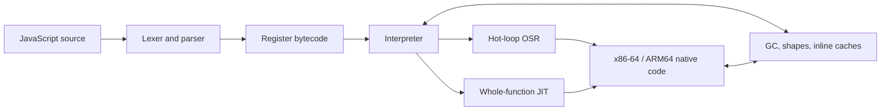

<p align="center">
  
</p>

<p align="center">
  <strong>Fast startup. Modern JavaScript. Native JITs. No borrowed parser or runtime.</strong>
</p>

<p align="center">
  <a href="#quick-start">Quick start</a> ·
  <a href="#performance-measured-honestly">Performance</a> ·
  <a href="#choose-the-right-execution-profile">Security</a> ·
  <a href="DOC.md">Reference</a> ·
  <a href="PERF_ROADMAP.md">Roadmap</a>
</p>

Zipp is a clean-sheet JavaScript engine written in Rust: lexer, parser,
bytecode compiler, NaN-boxed register VM, garbage collector, inline caches, and
native JITs all live in this repository. It is designed for embedders and tools
that want modern ECMAScript, very fast process startup, and an engine whose
implementation can be read end to end.

> The goal is ambitious and literal: become faster than Node, Bun, and Deno on
> every maintained benchmark while preserving exact output and tier parity.
> Zipp is not there yet. The tables below show both the wins and the remaining
> gaps.

## Why Zipp

| Strength | Current verified state |
|---|---|
| **Starts quickly** | **7.9 ms** median process launch in the canonical four-engine capture; no snapshot to load. |
| **Runs modern JavaScript** | **99.997% of test262**: 95,939 / 95,942 required executions. |
| **Competes today** | Canonical equal-row all-30 geomean **0.768× Node**; normal all-13 **0.642×** and hostile all-17 **0.881×**. Lower is faster. |
| **Owns the stack** | Project-native parser, VM, GC, object model, regex fork, x86-64 JIT, and guarded ARM64 baseline JIT. |
| **Measures honestly** | Exact stdout, counterbalanced runs, clean-source provenance, drift checks, confidence intervals, and a fail-closed publication policy. |
| **Offers explicit trust profiles** | Maximum-throughput CLI, interpreter-only WebAssembly boundary, and a separately resolved hardened native runner. |

## Quick start

The [`v0.0.5` release](https://github.com/f2i-com/zipp.org/releases/tag/v0.0.5)
contains ready-to-run x86-64 binaries and a browser WebAssembly package.

### Windows

Download, extract, and run the native Windows executable from PowerShell:

```powershell
$version = '0.0.5'
$archive = "zipp-$version-x86_64-pc-windows-msvc.zip"
Invoke-WebRequest "https://github.com/f2i-com/zipp.org/releases/download/v$version/$archive" -OutFile $archive
Expand-Archive -LiteralPath $archive -DestinationPath .

& ".\zipp-$version-x86_64-pc-windows-msvc\zipp.exe" js .\app.js
```

Use `mjs` instead of `js` for an ES module entry, including top-level `await`.

### Linux

Download, extract, and run the native Linux binary:

```sh
version=0.0.5
archive="zipp-$version-x86_64-unknown-linux-gnu.tar.gz"
curl -fLO "https://github.com/f2i-com/zipp.org/releases/download/v$version/$archive"
tar -xzf "$archive"

"./zipp-$version-x86_64-unknown-linux-gnu/zipp" js ./app.js
```

The archive preserves the executable bit. If another tool removes it, restore it
with `chmod +x zipp-0.0.5-x86_64-unknown-linux-gnu/zipp`.

### Build from source

Install stable Rust and its platform toolchain (MSVC Build Tools on Windows, or
a C compiler and linker on Linux). On Windows, run this in PowerShell:

```powershell
git clone https://github.com/f2i-com/zipp.org.git zipp
Set-Location zipp
cargo build --locked --release

.\target\release\zipp.exe js .\app.js
```

On Linux:

```sh
git clone https://github.com/f2i-com/zipp.org.git zipp
cd zipp
cargo build --locked --release

./target/release/zipp js app.js
./target/release/zipp mjs app.mjs   # ES module entry, including top-level await
```

A release build uses fat LTO and one codegen unit, so the final link is
deliberately slower than a development build. The resulting executable has no
runtime data-file dependency.

### Embed Zipp WebAssembly in a web app

Download the browser bundle, then serve its JavaScript and WebAssembly files
from the same origin as your app:

```sh
version=0.0.5
archive="zipp-wasm-$version-web.zip"
curl -fLO "https://github.com/f2i-com/zipp.org/releases/download/v$version/$archive"
unzip "$archive"

mkdir -p public/zipp-wasm
cp "zipp-wasm-$version-web/zipp_wasm.js" \
   "zipp-wasm-$version-web/zipp_wasm_bg.wasm" \
   public/zipp-wasm/
```

For arbitrary code, do not run the synchronous engine on the page's main
thread. Add this dedicated module Worker as `public/zipp-wasm/worker.js`:

```js
import init, { Engine } from "./zipp_wasm.js";

await init({
  module_or_path: new URL("./zipp_wasm_bg.wasm", import.meta.url),
});

self.onmessage = ({ data }) => {
  let engine;
  try {
    engine = new Engine();
    engine.initScript(data.source);
    self.postMessage({ type: "result", output: engine.takeOutput() });
  } catch (error) {
    self.postMessage({ type: "error", error: String(error) });
  } finally {
    engine?.dispose();
  }
};

self.postMessage({ type: "ready" });
```

Start one fresh Worker per run from responsive page code. The page owns both
the load deadline and the execution deadline, so it can forcibly terminate a
Worker even while guest JavaScript is blocking it:

```js
export function runZipp(source, timeoutMs = 2_500) {
  return new Promise((resolve, reject) => {
    const worker = new Worker("/zipp-wasm/worker.js", { type: "module" });
    let settled = false;
    let timer = setTimeout(
      () => finish(reject, new Error("Zipp WebAssembly failed to load")),
      15_000,
    );

    function finish(callback, value) {
      if (settled) return;
      settled = true;
      clearTimeout(timer);
      worker.terminate();
      callback(value);
    }

    worker.onmessage = ({ data }) => {
      if (data.type === "ready") {
        clearTimeout(timer);
        timer = setTimeout(
          () => finish(reject, new Error("JavaScript execution timed out")),
          timeoutMs,
        );
        worker.postMessage({ source });
      } else if (data.type === "result") {
        finish(resolve, data.output);
      } else if (data.type === "error") {
        finish(reject, new Error(data.error));
      }
    };

    worker.onerror = (event) =>
      finish(reject, event.error ?? new Error(event.message));
  });
}

const lines = await runZipp('console.log("Hello from Zipp");');
document.querySelector("#output").textContent = lines.join("\n");
```

Serve the app over HTTP(S), not `file://`, configure `.wasm` as
`application/wasm`, and adjust `/zipp-wasm/worker.js` if the app is hosted below
a URL prefix. A Content Security Policy must allow `'wasm-unsafe-eval'` in
`script-src` and the Worker URL in `worker-src`. `Engine` also enforces
instruction, heap, output, source, and WebAssembly-memory ceilings; Worker
termination supplies the separate wall-clock boundary. The browser build is
interpreter-only and grants no host capabilities by default. See the
[`zipp-wasm` guide](crates/zipp-wasm/README.md) before exposing bridges or
accepting multi-tenant input.

## Choose the right execution profile

| Input | Use | Boundary |
|---|---|---|
| Trusted programs and benchmarks | `zipp js` / `zipp mjs` | Maximum-throughput native CLI with JITs enabled. |
| Arbitrary browser-hosted code | [`zipp-wasm`](crates/zipp-wasm/README.md) in a dedicated Worker | Interpreter-only `safe-sandbox` build; terminate and replace the Worker at the wall deadline and between tenants. |
| Hardened native execution | [`zipp-sandbox`](crates/zipp-sandbox/README.md) | Separately resolved, no-JIT, unsafe-forbidden engine with instruction, heap, output, import, and wall-time limits. |

Build the hardened native runner separately so Cargo cannot unify its safety
features with the ordinary JIT workspace:

```sh
cargo build --locked --release --manifest-path crates/zipp-sandbox/Cargo.toml
./crates/zipp-sandbox/target/release/zipp-sandbox script.js
```

Imports are denied unless the host supplies one canonical root. The native
runner is language/process/resource containment, not a kernel sandbox; use a
restricted account, container, or OS sandbox when the threat model requires
one. See [`SECURITY.md`](SECURITY.md) for the full deployment checklist.

## Performance, measured honestly

### QuickJS-NG and Boa diagnostic — v0.0.5

The v0.0.5 release was also measured against pinned interpreter builds of
QuickJS-NG v0.16.2 and Boa v0.22.0. These are clean release-default builds on
the same Windows x86-64 host, with identical generated source, exact-output
validation, six counterbalanced repetitions, and 10,000 paired-bootstrap
samples. Ratios are Zipp / competitor, so lower is faster.

| Native diagnostic | Zipp interpreter / competitor | 95% CI | point wins |
|---|---:|---:|---:|
| frozen real13 vs QuickJS-NG | **0.6413×** | 0.6386–0.6452 | 12 / 13 |
| micro5 vs QuickJS-NG | **0.8556×** | 0.8405–0.8761 | 5 / 5 |
| micro5 vs Boa | **0.2539×** | 0.2501–0.2590 | 5 / 5 |
| micro5 vs Boa `--optimize` | **0.2522×** | 0.2493–0.2593 | 5 / 5 |

The native result is an aggregate win, not a universal claim: QuickJS-NG was
1.0099× faster at the point median on the retained sparse-array row, while
Zipp led the other twelve. The browser-WASM comparison has a different result:
Zipp is **0.2274× Boa** but **2.1074× QuickJS-NG** on adjusted execution across
the five diagnostic workloads. Zipp's stripped module is 5,595,833 bytes raw
(1,254,075 Brotli-11), between QuickJS-NG's 1,528,293-byte reactor
(417,087 Brotli-11) and Boa's 21,296,176-byte module (5,484,164 Brotli-11).

The commands, exact revisions, per-row numbers, module hashes, host-interface
differences, and limitations are in
[`bench/comparison/README.md`](bench/comparison/README.md). These ecosystem
comparisons are deliberately separate from the canonical Node/Bun/Deno series
below.

### Canonical public capture

The current public evidence is the clean PGO capture at engine commit
`21288c1`: [`real13_21288c1_pgo_2026-08-30.json`](bench/real13_21288c1_pgo_2026-08-30.json)
and [`head_clean_21288c1_pgo_2026-08-30.json`](bench/hostile/head_clean_21288c1_pgo_2026-08-30.json).
Both artifacts record `publishable:true`, `ALL_CORRECT=1`, 15 complete
counterbalanced repetitions, 10,000 bootstrap samples, exact output, and no
source, engine, input, environment, process-health, or harness drift.

Node v24.12.0 · Bun 1.3.14 · Deno 2.6.10 · Zipp 0.0.1 canonical PGO SHA-256
`c2ddb9e6…6a3cb5`.

Cold medians include process launch; bold marks the lowest displayed median.

| Retained benchmark | Node | Bun | Deno | Zipp | Zipp / Node |
|---|---:|---:|---:|---:|---:|
| async-promise-chain | **329 ms** | 364 ms | 355 ms | 404 ms | 1.23× |
| class-prototype-hot | 295 ms | 333 ms | 326 ms | **224 ms** | **0.76×** |
| json-large | 259 ms | **190 ms** | 308 ms | 269 ms | 1.05× |
| map-set-heavy | 688 ms | 784 ms | 1,156 ms | **579 ms** | **0.85×** |
| markdown-render | 269 ms | **207 ms** | 311 ms | 232 ms | **0.87×** |
| parse-large-js | 270 ms | **227 ms** | 286 ms | 240 ms | **0.89×** |
| polymorphic-objects | 326 ms | 330 ms | 335 ms | **307 ms** | **0.94×** |
| regex-log-scan | 465 ms | 555 ms | **458 ms** | 476 ms | 1.02× |
| sparse-array | **80 ms** | 102 ms | 125 ms | 82 ms | 1.05× |
| typedarray-math | 198 ms | 909 ms | 168 ms | **133 ms** | **0.67×** |
| **Zipp / engine paired geomean** | **0.921×** [0.913, 0.928] | **0.782×** [0.778, 0.789] | **0.797×** [0.790, 0.806] | — | — |

The three architecture diagnostics remain outside the retained-ten headline:

| Diagnostic | Node | Bun | Deno | Zipp | Zipp / Node |
|---|---:|---:|---:|---:|---:|
| polymorphic-objects-v2 | 81 ms | 87 ms | 129 ms | **24 ms** | **0.29×** |
| property-ic-shapes | 259 ms | 158 ms | 311 ms | **11 ms** | **0.04×** |
| sparse-array-v2 | 168 ms | 366 ms | 182 ms | **101 ms** | **0.60×** |
| **Zipp / engine paired geomean** | **0.192×** [0.191, 0.195] | **0.171×** [0.168, 0.174] | **0.152×** [0.150, 0.155] | — | — |

Across all 13 normal rows, Zipp measures **0.642× Node** [0.638, 0.646],
**0.550× Bun** [0.547, 0.555], and **0.544× Deno** [0.540, 0.549]. It wins
29 of 39 point comparisons and 29 of 39 Bonferroni exact-sign comparisons.

The separately measured 17-case hostile corpus covers closures, mixed locals,
shape churn, GC survival, async lifetimes, modules, a React-shaped kernel, a
warm router, a JavaScript bytecode VM, and vendored NanoID:

| Hostile metric | vs Node | vs Bun | vs Deno |
|---|---:|---:|---:|
| ordinary equal-row geomean | **0.881×** [0.874, 0.886] | **0.670×** [0.665, 0.677] | **0.455×** [0.450, 0.461] |
| category-balanced geomean | **0.913×** [0.907, 0.919] | **0.686×** [0.678, 0.695] | **0.467×** [0.462, 0.473] |

For the requested project-wide view, the explicit equal-row aggregate across
all 30 normal and hostile rows is **0.768× Node** [0.764, 0.771], **0.615× Bun**
[0.613, 0.620], and **0.492× Deno** [0.489, 0.496]. It is calculated as
`exp((13 × ln(G13) + 17 × ln(G17)) / 30)`; its descriptive bootstrap resamples
the two separately captured suites as independent strata.

The aggregate is ahead, but the literal every-row target is not met. Zipp has
17 of 30 Node point wins. The current Node point gaps are async promises, JSON,
regex, and sparse arrays in the normal set, plus closure calls, both shape
stressors, allocation survival, long-lived async, React reconcile, warm router,
the bytecode VM, and NanoID in the hostile set. The hostile guide reports each
ratio rather than hiding these behind the geomean.

```text
FASTER_THAN_NODE_ON_EVERY_ROW=0
FASTER_THAN_EVERY_ENGINE_ON_EVERY_ROW=0
```

The `21288c1` engine adds stable paired-`typeof` fusion, a guarded Tier-C
loose-null lane, polymorphic Cross3 call routing, and a deferred flat-ASCII
append cursor. It also fixes protected returns through `finally`. See the
[`bench` guide](bench/README.md), [hostile suite](bench/hostile/README.md), and
[`PERF_ROADMAP.md`](PERF_ROADMAP.md) for exact methodology and remaining work.

## Correctness and language coverage

Zipp currently passes **95,939 of 95,942** required test262 executions. The
three blessed failures are one Annex B test carrying a superseded ES2017
expectation and two rows that require German CLDR data; the exact list is
[`tools/test262-expected-failures.txt`](tools/test262-expected-failures.txt).
The former errored-module-cycle and deferred top-level-await failures are fixed.

The standing correctness strategy compares default JIT, interpreter-only,
forced-JIT, and majors-only-GC modes. A tier-differential fuzzer also generates
self-checking programs and compares Node, the interpreter, and tier-forcing
switches; benchmarks alone are never treated as proof of language correctness.

ES2015–ES2025 is essentially complete, including:

- classes, private elements, static blocks, and all eight decorator kinds;
- generators, async generators, promises, iterator helpers, and explicit
  resource management;
- 12 TypedArray kinds including `Float16Array`, `DataView`, shared memory, and
  atomics;
- `BigInt`, `Proxy`/`Reflect`, modern regular expressions, and `Temporal` with
  fifteen calendars;
- ES modules, dynamic/typed/deferred/source-phase imports, and top-level await;
- `eval`, `Function`, `ShadowRealm`, structured cloning, and browser-oriented
  embedding APIs.

Only the `en` CLDR locale ships today. The detailed support notes and durable
architecture reference live in [`DOC.md`](DOC.md).

## How it works



x86-64 has the mature function, OSR, helper, inline-cache, integer, double, and
guarded reducer tiers. ARM64 has a smaller guarded whole-function integer
baseline. wasm32 and unsupported native targets use the pure interpreter.

Workspace map:

| Path | Purpose |
|---|---|
| [`crates/zipp-vm`](crates/zipp-vm) | Parser, compiler, VM, runtime, GC, and JITs. |
| [`crates/zipp-cli`](crates/zipp-cli) | `zipp js` / `zipp mjs` command line. |
| [`crates/regress-fork`](crates/regress-fork) | ECMAScript regex engine fork and conformance fixes. |
| [`crates/zipp-wasm`](crates/zipp-wasm/README.md) | Browser/Worker embedding. |
| [`crates/zipp-sandbox`](crates/zipp-sandbox/README.md) | Separately resolved hardened native runner. |

## Reproduce and contribute

Run the release tests before changing the engine:

```sh
cargo test --workspace --release
cargo check -p zipp-vm --no-default-features
cargo check -p zipp-vm --no-default-features --features safe-sandbox
```

Build the measured Windows PGO binary from an x64 Visual Studio Developer
PowerShell with native Git Bash:

```powershell
& 'C:\Program Files\Git\bin\bash.exe' tools/pgo.sh
```

Routine benchmark artifacts belong under ignored `target/bench-results/`.
Only deliberately reviewed canonical evidence is promoted into `bench/`.
Commands, suite ownership, publication rules, and A/B examples are in
[`bench/README.md`](bench/README.md).

The project keeps negative results because a measured refutation is cheaper
than repeating the same attractive mistake. Start with:

| Document | Use it for |
|---|---|
| [`DOC.md`](DOC.md) | Durable architecture, language, embedding, and development reference. |
| [`PERF_ROADMAP.md`](PERF_ROADMAP.md) | Current performance evidence, open targets, and next gates. |
| [`HANDOFF.md`](HANDOFF.md) | Exact current continuation state and commands. |
| [`SECURITY.md`](SECURITY.md) | Threat model and deployment requirements. |
| [`docs/archive`](docs/archive/README.md) | Dated historical handoffs, designs, and the full experiment ledger. |

Small, independently measured changes are preferred. Keep correctness and
benchmark output exact, include an off-switch for risky optimizations, report
neutral or negative evidence, and do not update the public engine table without
a clean canonical capture.

## License

[Apache-2.0](LICENSE-APACHE).
