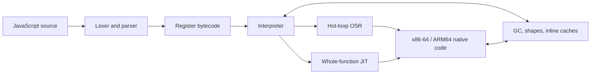

<p align="center">
  
</p>

<p align="center">
  <strong>Fast startup. Modern JavaScript. Native JITs. No borrowed parser or runtime.</strong>
</p>

<p align="center">
  <a href="#quick-start">Quick start</a> ·
  <a href="#performance-measured-honestly">Performance</a> ·
  <a href="#choose-the-right-execution-profile">Security</a> ·
  <a href="DOC.md">Reference</a> ·
  <a href="PERF_ROADMAP.md">Roadmap</a>
</p>

Zipp is a clean-sheet JavaScript engine written in Rust: lexer, parser,
bytecode compiler, NaN-boxed register VM, garbage collector, inline caches, and
native JITs all live in this repository. It is designed for embedders and tools
that want modern ECMAScript, very fast process startup, and an engine whose
implementation can be read end to end.

> The goal is ambitious and literal: become faster than Node, Bun, and Deno on
> every maintained benchmark while preserving exact output and tier parity.
> Zipp is not there yet. The tables below show both the wins and the remaining
> gaps.

## Why Zipp

| Strength | Current verified state |
|---|---|
| **Starts quickly** | **7.4 ms** median process launch in the canonical four-engine capture (Node 30.4 ms, Bun 43.3 ms, Deno 82.6 ms); no snapshot to load. |
| **Runs modern JavaScript** | **99.997% of test262**: 95,939 / 95,942 required executions. |
| **Competes today** | Canonical equal-row all-30 geomean **0.728× Node**; normal all-13 **0.614×** and hostile all-17 **0.829×**. Lower is faster. |
| **Owns the stack** | Project-native parser, VM, GC, object model, regex fork, x86-64 JIT, and guarded ARM64 baseline JIT. |
| **Measures honestly** | Exact stdout, counterbalanced runs, clean-source provenance, drift checks, confidence intervals, and a fail-closed publication policy. |
| **Offers explicit trust profiles** | Maximum-throughput CLI, interpreter-only WebAssembly boundary, and a separately resolved hardened native runner. |

## Quick start

The [`v0.0.14` release](https://github.com/f2i-com/zipp.org/releases/tag/v0.0.14)
contains ready-to-run x86-64 binaries and a browser WebAssembly package.

### Windows

Download, extract, and run the native Windows executable from PowerShell:

```powershell
$version = '0.0.14'
$archive = "zipp-$version-x86_64-pc-windows-msvc.zip"
Invoke-WebRequest "https://github.com/f2i-com/zipp.org/releases/download/v$version/$archive" -OutFile $archive
Expand-Archive -LiteralPath $archive -DestinationPath .

& ".\zipp-$version-x86_64-pc-windows-msvc\zipp.exe" js .\app.js
```

Use `mjs` instead of `js` for an ES module entry, including top-level `await`.

### Linux

Download, extract, and run the native Linux binary:

```sh
version=0.0.14
archive="zipp-$version-x86_64-unknown-linux-gnu.tar.gz"
curl -fLO "https://github.com/f2i-com/zipp.org/releases/download/v$version/$archive"
tar -xzf "$archive"

"./zipp-$version-x86_64-unknown-linux-gnu/zipp" js ./app.js
```

The archive preserves the executable bit. If another tool removes it, restore it
with `chmod +x zipp-0.0.14-x86_64-unknown-linux-gnu/zipp`.

### Build from source

Install stable Rust and its platform toolchain (MSVC Build Tools on Windows, or
a C compiler and linker on Linux). On Windows, run this in PowerShell:

```powershell
git clone https://github.com/f2i-com/zipp.org.git zipp
Set-Location zipp
cargo build --locked --release

.\target\release\zipp.exe js .\app.js
```

On Linux:

```sh
git clone https://github.com/f2i-com/zipp.org.git zipp
cd zipp
cargo build --locked --release

./target/release/zipp js app.js
./target/release/zipp mjs app.mjs   # ES module entry, including top-level await
```

A release build uses fat LTO and one codegen unit, so the final link is
deliberately slower than a development build. The resulting executable has no
runtime data-file dependency.

### Embed Zipp WebAssembly in a web app

Download the browser bundle, then serve its JavaScript and WebAssembly files
from the same origin as your app:

```sh
version=0.0.14
archive="zipp-wasm-$version-web.zip"
curl -fLO "https://github.com/f2i-com/zipp.org/releases/download/v$version/$archive"
unzip "$archive"

mkdir -p public/zipp-wasm
cp "zipp-wasm-$version-web/zipp_wasm.js" \
   "zipp-wasm-$version-web/zipp_wasm_bg.wasm" \
   public/zipp-wasm/
```

For arbitrary code, do not run the synchronous engine on the page's main
thread. Add this dedicated module Worker as `public/zipp-wasm/worker.js`:

```js
import init, { Engine } from "./zipp_wasm.js";

await init({
  module_or_path: new URL("./zipp_wasm_bg.wasm", import.meta.url),
});

self.onmessage = ({ data }) => {
  let engine;
  try {
    engine = new Engine();
    engine.initScript(data.source);
    self.postMessage({ type: "result", output: engine.takeOutput() });
  } catch (error) {
    self.postMessage({ type: "error", error: String(error) });
  } finally {
    engine?.dispose();
  }
};

self.postMessage({ type: "ready" });
```

Start one fresh Worker per run from responsive page code. The page owns both
the load deadline and the execution deadline, so it can forcibly terminate a
Worker even while guest JavaScript is blocking it:

```js
export function runZipp(source, timeoutMs = 2_500) {
  return new Promise((resolve, reject) => {
    const worker = new Worker("/zipp-wasm/worker.js", { type: "module" });
    let settled = false;
    let timer = setTimeout(
      () => finish(reject, new Error("Zipp WebAssembly failed to load")),
      15_000,
    );

    function finish(callback, value) {
      if (settled) return;
      settled = true;
      clearTimeout(timer);
      worker.terminate();
      callback(value);
    }

    worker.onmessage = ({ data }) => {
      if (data.type === "ready") {
        clearTimeout(timer);
        timer = setTimeout(
          () => finish(reject, new Error("JavaScript execution timed out")),
          timeoutMs,
        );
        worker.postMessage({ source });
      } else if (data.type === "result") {
        finish(resolve, data.output);
      } else if (data.type === "error") {
        finish(reject, new Error(data.error));
      }
    };

    worker.onerror = (event) =>
      finish(reject, event.error ?? new Error(event.message));
  });
}

const lines = await runZipp('console.log("Hello from Zipp");');
document.querySelector("#output").textContent = lines.join("\n");
```

Serve the app over HTTP(S), not `file://`, configure `.wasm` as
`application/wasm`, and adjust `/zipp-wasm/worker.js` if the app is hosted below
a URL prefix. A Content Security Policy must allow `'wasm-unsafe-eval'` in
`script-src` and the Worker URL in `worker-src`. `Engine` also enforces
instruction, heap, output, source, and WebAssembly-memory ceilings; Worker
termination supplies the separate wall-clock boundary. The browser build is
interpreter-only and grants no host capabilities by default. See the
[`zipp-wasm` guide](crates/zipp-wasm/README.md) before exposing bridges or
accepting multi-tenant input.

## Choose the right execution profile

| Input | Use | Boundary |
|---|---|---|
| Trusted programs and benchmarks | `zipp js` / `zipp mjs` | Maximum-throughput native CLI with JITs enabled. |
| Arbitrary browser-hosted code | [`zipp-wasm`](crates/zipp-wasm/README.md) in a dedicated Worker | Interpreter-only `safe-sandbox` build; terminate and replace the Worker at the wall deadline and between tenants. |
| Hardened native execution | [`zipp-sandbox`](crates/zipp-sandbox/README.md) | Separately resolved, no-JIT, unsafe-forbidden engine with instruction, heap, output, import, and wall-time limits. |

Build the hardened native runner separately so Cargo cannot unify its safety
features with the ordinary JIT workspace:

```sh
cargo build --locked --release --manifest-path crates/zipp-sandbox/Cargo.toml
./crates/zipp-sandbox/target/release/zipp-sandbox script.js
```

Imports are denied unless the host supplies one canonical root. The native
runner is language/process/resource containment, not a kernel sandbox; use a
restricted account, container, or OS sandbox when the threat model requires
one. See [`SECURITY.md`](SECURITY.md) for the full deployment checklist.

## Performance, measured honestly

### QuickJS-NG and Boa diagnostics

#### Historical v0.0.5 release

The v0.0.5 release was also measured against pinned interpreter builds of
QuickJS-NG v0.16.2 and Boa v0.22.0. These are clean release-default builds on
the same Windows x86-64 host, with identical generated source, exact-output
validation, six counterbalanced repetitions, and 10,000 paired-bootstrap
samples. Ratios are Zipp / competitor, so lower is faster.

| Native diagnostic | Zipp interpreter / competitor | 95% CI | point wins |
|---|---:|---:|---:|
| frozen real13 vs QuickJS-NG | **0.6413×** | 0.6386–0.6452 | 12 / 13 |
| micro5 vs QuickJS-NG | **0.8556×** | 0.8405–0.8761 | 5 / 5 |
| micro5 vs Boa | **0.2539×** | 0.2501–0.2590 | 5 / 5 |
| micro5 vs Boa `--optimize` | **0.2522×** | 0.2493–0.2593 | 5 / 5 |

The native result is an aggregate win, not a universal claim: QuickJS-NG was
1.0099× faster at the point median on the retained sparse-array row, while
Zipp led the other twelve. In the historical v0.0.5 browser-WASM release
capture, Zipp measured **0.2274× Boa** but **2.1074× QuickJS-NG** on adjusted
execution across the five diagnostic workloads. That release's stripped module
is 5,595,833 bytes raw (1,254,075 Brotli-11), between QuickJS-NG's
1,528,293-byte reactor (417,087 Brotli-11) and Boa's 21,296,176-byte module
(5,484,164 Brotli-11).

#### v0.0.6 native confirmation

The clean default-feature v0.0.6 release binary at engine-source commit
`e3acee352074` reran all 13 current real13 inputs against QuickJS-NG v0.16.2,
with the runner selecting Zipp's interpreter through `ZIPP_NOJIT=1`. All 39
canonicalized validation outputs matched after the documented QuickJS CRLF-to-LF
normalization; raw output bytes and hashes remain recorded. Across six
counterbalanced rounds, Zipp won all 13 point medians: Zipp / QuickJS-NG was
`0.6089665×` (descriptive 95% interval 0.6072021–0.6122180) for cold
fresh-process time and `0.6058409×` (0.6041440–0.6090422) after paired
empty-launch subtraction. This confirms the native interpreter result on the
final engine code; it does not predict WASM performance.

#### v0.0.6 browser-WASM status

The committed production module, built from the v0.0.13 source, is 5,558,860 bytes raw, 1,812,458 at
gzip-9, and 1,248,649 at Brotli-11 (SHA-256
`bd8614fe5f3a3b8ef67f4b917cdefebb3fe69afa39a9804a0d3f6b0b6b267126`). The
official QuickJS-NG v0.16.2 reactor is 1,528,293 bytes raw and 417,087 at
Brotli-11, so Zipp is `3.586×` as large raw and `2.958×` as large on the wire.

Main has moved past that module. On 2026-09-05 an external audit of the
WASM build was implemented as B274-B278 (see
[`PERF_ROADMAP.md`](PERF_ROADMAP.md)): interpreter-side changes that close
four cliffs the native PGO capture never sees. Every unit-addressed read on a
non-ASCII string decoded from byte zero, so scanning loops were quadratic;
the string-part allocation preflight walked the whole heap on a window blind
to the heap's size; `eval` / `new Function` code owned no inline caches; and
an array with a named property lost its dense read path. The figures below
are interleaved A/B medians of the wasm artifact built from `400bcfe3`
against the same artifact with these changes, on a shared developer machine
with other work running, so they are diagnostic, not a canonical capture;
the control kernels (ASCII scans, plain and fused calls, main-code property
loops) moved within ±4%.

| Wasm kernel | `400bcfe3` | with B274-B278 |
|---|---:|---:|
| sequential `charCodeAt` over 64K non-ASCII units | 4,462 ms | 3.2 ms |
| word tokenizer over 64K mostly-ASCII units with a few accents | 9,828 ms | 8.2 ms |
| one-unit `slice` loop, 16K non-ASCII units | 449 ms | 4.3 ms |
| `join` of 4,000 parts × 200, 300K objects retained | 8,423 ms | 138 ms |
| `join` of 4,000 parts × 200, small heap | 548 ms | 130 ms |
| monomorphic property loop installed through `new Function` | 20.9 ms | 14.8 ms |
| `a[i]` loop on an array carrying a named property | 13.3 ms | 9.6 ms |

The committed module above predates these; it is rebuilt at the next
release, and the harness that produced the rows is
`crates/zipp-wasm/tests/node/bench.cjs`-style (persistent `Engine`, warmed,
interleaved builds).

We also attempted a direct, unscaled WASM run over the same v0.0.6
normal 13 and hostile 17 sources used by the v0.0.6 Node/Bun/Deno reruns in
`target/bench-results/real13-v006-6650647a718c-pgo-15.json` and
`target/bench-results/hostile17-v006-6650647a718c-pgo-15.json`. Those sources
are newer than the retained canonical public capture below. The WASM capture
preserves their exact bytes and Node output oracle, but it is explicitly
`publishable:false`: the production Zipp WASM API cannot load the two module
rows, QuickJS-NG's official reactor cannot drain pending jobs for three async
rows, and Zipp validated only 7 of the 28 script rows. Seventeen Zipp rows hit
the fixed production instruction or heap ceilings and four ended in other
engine errors. There were consequently no comparable normal-suite rows and
only five comparable hostile rows.

On those five available rows, Zipp / QuickJS-NG was `0.9604×` for persistent
time and `0.9567×` after paired-control subtraction, with Zipp ahead only on
`warm-router` (1 / 5 point wins). Those are incomplete row-level diagnostics,
not full-suite geomeans: this run does **not** establish that Zipp WASM is faster
than QuickJS-NG WASM. Zipp's separately sampled compile median was slower
(5.080 ms versus 1.795 ms), while its instantiation/start median was faster
(0.397 ms versus 1.676 ms). Their sums are not a measured end-to-end median.

The separate five-workload speed-kernel experiment remains useful attribution
evidence: it measured `0.0954663913×` QuickJS-NG on persistent time. It is highly
specialization-sensitive, however; disabling the exact workload lanes measured
`1.815×` QuickJS-NG but `0.199×` Boa, with Zipp ahead of Boa on all five rows.
That control used a dirty-tree diagnostic candidate, not the release artifact.
No current same-source normal-13-plus-hostile-17 Boa WASM run exists, so neither
micro result is a general interpreter ranking or a substitute for the
incomplete exact-suite result above.

The commands, exact revisions, all validation failures, per-row numbers, module
hashes, host-interface differences, and limitations are in
[`bench/comparison/README.md`](bench/comparison/README.md). These ecosystem
comparisons are deliberately separate from the canonical Node/Bun/Deno series
below.

### Canonical public capture

The current public evidence is the clean PGO capture at engine commit
`8229b3fc`: [`real13_8229b3fc_pgo_2026-09-02.json`](bench/real13_8229b3fc_pgo_2026-09-02.json)
and [`head_clean_8229b3fc_pgo_2026-09-02.json`](bench/hostile/head_clean_8229b3fc_pgo_2026-09-02.json).
Both artifacts record `publishable:true`, `ALL_CORRECT=1`, 15 complete
counterbalanced repetitions, 10,000 bootstrap samples, exact output, and no
source, engine, input, environment, process-health, or harness drift.

Node v24.12.0 · Bun 1.3.14 · Deno 2.6.10 · Zipp 0.0.13 canonical PGO SHA-256
`bf9fddab…dc9986`.

Cold medians include process launch; bold marks the lowest displayed median.

| Retained benchmark | Node | Bun | Deno | Zipp | Zipp / Node |
|---|---:|---:|---:|---:|---:|
| async-promise-chain | **334 ms** | 369 ms | 359 ms | 372 ms | 1.12× |
| class-prototype-hot | 297 ms | 332 ms | 329 ms | **226 ms** | **0.77×** |
| json-large | 270 ms | **192 ms** | 322 ms | 271 ms | 1.01× |
| map-set-heavy | 784 ms | 855 ms | 1,264 ms | **672 ms** | **0.84×** |
| markdown-render | 268 ms | **207 ms** | 316 ms | 209 ms | **0.77×** |
| parse-large-js | 273 ms | **230 ms** | 296 ms | 233 ms | **0.86×** |
| polymorphic-objects | 328 ms | 331 ms | 340 ms | **309 ms** | **0.94×** |
| regex-log-scan | 478 ms | 564 ms | 460 ms | **448 ms** | **0.94×** |
| sparse-array | 81 ms | 113 ms | 129 ms | **73 ms** | **0.91×** |
| typedarray-math | 200 ms | 914 ms | 170 ms | **144 ms** | **0.72×** |
| **Zipp / engine paired geomean** | **0.878×** [0.875, 0.884] | **0.752×** [0.747, 0.755] | **0.765×** [0.761, 0.774] | — | — |

The three architecture diagnostics remain outside the retained-ten headline:

| Diagnostic | Node | Bun | Deno | Zipp | Zipp / Node |
|---|---:|---:|---:|---:|---:|
| polymorphic-objects-v2 | 81 ms | 87 ms | 131 ms | **24 ms** | **0.30×** |
| property-ic-shapes | 265 ms | 158 ms | 319 ms | **10 ms** | **0.04×** |
| sparse-array-v2 | 171 ms | 366 ms | 184 ms | **99 ms** | **0.59×** |
| **Zipp / engine paired geomean** | **0.186×** [0.183, 0.188] | **0.166×** [0.164, 0.169] | **0.145×** [0.143, 0.149] | — | — |

Across all 13 normal rows, Zipp measures **0.614× Node** [0.611, 0.617],
**0.531× Bun** [0.528, 0.533], and **0.521× Deno** [0.519, 0.526]. It wins
33 of 39 point comparisons and 31 of 39 Bonferroni exact-sign comparisons.

The separately measured 17-case hostile corpus covers closures, mixed locals,
shape churn, GC survival, async lifetimes, modules, a React-shaped kernel, a
warm router, a JavaScript bytecode VM, and vendored NanoID:

| Hostile metric | vs Node | vs Bun | vs Deno |
|---|---:|---:|---:|
| ordinary equal-row geomean | **0.829×** [0.820, 0.833] | **0.647×** [0.643, 0.655] | **0.419×** [0.415, 0.423] |
| category-balanced geomean | **0.862×** [0.852, 0.865] | **0.661×** [0.656, 0.673] | **0.432×** [0.429, 0.436] |

For the requested project-wide view, the explicit equal-row aggregate across
all 30 normal and hostile rows is **0.728× Node** [0.723, 0.730], **0.594× Bun**
[0.591, 0.598], and **0.460× Deno** [0.458, 0.464]. It is calculated as
`exp((13 × ln(G13) + 17 × ln(G17)) / 30)`; its descriptive bootstrap resamples
the two separately captured suites as independent strata.

The aggregate is ahead, but the literal every-row target is not met. Zipp has
21 of 30 Node point wins. The current Node point gaps are async promises and
JSON in the normal set, plus closure calls, both shape stressors, allocation
survival, long-lived async, React reconcile, and the warm router in the hostile
set (the JSON and long-lived async intervals cross parity; both are 1.005×).
The hostile guide reports each ratio rather than hiding these behind the
geomean.

```text
FASTER_THAN_NODE_ON_EVERY_ROW=0
FASTER_THAN_EVERY_ENGINE_ON_EVERY_ROW=0
```

The `8229b3fc` engine keeps the `c28781cf` levers (the inline dense-Array
store lane, the fused `| 0` add, B263's register classes) and adds B269-B273:
RegExp exec under a heap ceiling no longer walks the heap per exec, the recycle
pool's fallback sort is run-adaptive, a function that reaches itself through a
captured cell gets the native cross lane, bodies with `for...of` or `try`
receive a frame-backed cross entry instead of the interpreter trampoline, and
small holders take the holder-grain write barrier so an overwritten young value
no longer floats into old space. Each landed with a one-binary latch A/B; the
capture-to-capture row moves sit inside the intervals. Main has since added
B274-B278, which are interpreter-side (the wasm rows above) and leave this
native capture as the current public score. See the
[`bench` guide](bench/README.md), [hostile suite](bench/hostile/README.md), and
[`PERF_ROADMAP.md`](PERF_ROADMAP.md) for exact methodology and remaining work.

## Correctness and language coverage

Zipp currently passes **95,939 of 95,942** required test262 executions. The
three blessed failures are one Annex B test carrying a superseded ES2017
expectation and two rows that require German CLDR data; the exact list is
[`tools/test262-expected-failures.txt`](tools/test262-expected-failures.txt).
The former errored-module-cycle and deferred top-level-await failures are fixed.

The standing correctness strategy compares default JIT, interpreter-only,
forced-JIT, and majors-only-GC modes. A tier-differential fuzzer also generates
self-checking programs and compares Node, the interpreter, and tier-forcing
switches; benchmarks alone are never treated as proof of language correctness.

ES2015–ES2025 is essentially complete, including:

- classes, private elements, static blocks, and all eight decorator kinds;
- generators, async generators, promises, iterator helpers, and explicit
  resource management;
- 12 TypedArray kinds including `Float16Array`, `DataView`, shared memory, and
  atomics;
- `BigInt`, `Proxy`/`Reflect`, modern regular expressions, and `Temporal` with
  fifteen calendars;
- ES modules, dynamic/typed/deferred/source-phase imports, and top-level await;
- `eval`, `Function`, `ShadowRealm`, structured cloning, and browser-oriented
  embedding APIs.

Only the `en` CLDR locale ships today. The detailed support notes and durable
architecture reference live in [`DOC.md`](DOC.md).

## How it works



x86-64 has the mature function, OSR, helper, inline-cache, integer, double, and
guarded reducer tiers. ARM64 has a smaller guarded whole-function integer
baseline. wasm32 and unsupported native targets use the pure interpreter.

Workspace map:

| Path | Purpose |
|---|---|
| [`crates/zipp-vm`](crates/zipp-vm) | Parser, compiler, VM, runtime, GC, and JITs. |
| [`crates/zipp-cli`](crates/zipp-cli) | `zipp js` / `zipp mjs` command line. |
| [`crates/regress-fork`](crates/regress-fork) | ECMAScript regex engine fork and conformance fixes. |
| [`crates/zipp-wasm`](crates/zipp-wasm/README.md) | Browser/Worker embedding. |
| [`crates/zipp-sandbox`](crates/zipp-sandbox/README.md) | Separately resolved hardened native runner. |

## Reproduce and contribute

Run the release tests before changing the engine:

```sh
cargo test --workspace --release
cargo check -p zipp-vm --no-default-features
cargo check -p zipp-vm --no-default-features --features safe-sandbox
```

Build the measured Windows PGO binary from an x64 Visual Studio Developer
PowerShell with native Git Bash:

```powershell
& 'C:\Program Files\Git\bin\bash.exe' tools/pgo.sh
```

Routine benchmark artifacts belong under ignored `target/bench-results/`.
Only deliberately reviewed canonical evidence is promoted into `bench/`.
Commands, suite ownership, publication rules, and A/B examples are in
[`bench/README.md`](bench/README.md).

The project keeps negative results because a measured refutation is cheaper
than repeating the same attractive mistake. Start with:

| Document | Use it for |
|---|---|
| [`DOC.md`](DOC.md) | Durable architecture, language, embedding, and development reference. |
| [`PERF_ROADMAP.md`](PERF_ROADMAP.md) | Current performance evidence, open targets, and next gates. |
| [`HANDOFF.md`](HANDOFF.md) | Exact current continuation state and commands. |
| [`SECURITY.md`](SECURITY.md) | Threat model and deployment requirements. |
| [`docs/archive`](docs/archive/README.md) | Dated historical handoffs, designs, and the full experiment ledger. |

Small, independently measured changes are preferred. Keep correctness and
benchmark output exact, include an off-switch for risky optimizations, report
neutral or negative evidence, and do not update the public engine table without
a clean canonical capture.

## License

[Apache-2.0](LICENSE-APACHE).
