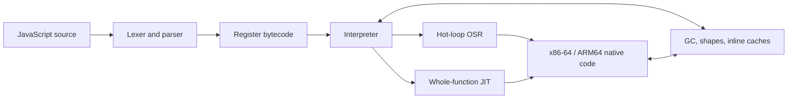

<p align="center">
  
</p>

<p align="center">
  <strong>Fast startup. Modern JavaScript. Native JITs. No borrowed parser or runtime.</strong>
</p>

<p align="center">
  <a href="#quick-start">Quick start</a> ·
  <a href="#performance-measured-honestly">Performance</a> ·
  <a href="#choose-the-right-execution-profile">Security</a> ·
  <a href="DOC.md">Reference</a> ·
  <a href="PERF_ROADMAP.md">Roadmap</a>
</p>

Zipp is a clean-sheet JavaScript engine written in Rust: lexer, parser,
bytecode compiler, NaN-boxed register VM, garbage collector, inline caches, and
native JITs all live in this repository. It is designed for embedders and tools
that want modern ECMAScript, very fast process startup, and an engine whose
implementation can be read end to end.

> The goal is ambitious and literal: become faster than Node, Bun, and Deno on
> every maintained benchmark while preserving exact output and tier parity.
> Zipp is not there yet. The tables below show both the wins and the remaining
> gaps.

## Why Zipp

| Strength | Current verified state |
|---|---|
| **Starts quickly** | **7.3 ms** median process launch in the canonical four-engine capture; no snapshot to load. |
| **Runs modern JavaScript** | **99.997% of test262**: 95,939 / 95,942 required executions. |
| **Competes today** | Canonical all-13 geomean **0.635× Node**; retained-ten headline **0.918× Node**. Lower is faster. |
| **Owns the stack** | Project-native parser, VM, GC, object model, regex fork, x86-64 JIT, and guarded ARM64 baseline JIT. |
| **Measures honestly** | Exact stdout, counterbalanced runs, clean-source provenance, drift checks, confidence intervals, and a fail-closed publication policy. |
| **Offers explicit trust profiles** | Maximum-throughput CLI, interpreter-only WebAssembly boundary, and a separately resolved hardened native runner. |

## Quick start

Stable Rust is the only build requirement for the ordinary CLI.

```sh
git clone https://github.com/f2i-com/zipp.org.git zipp
cd zipp
cargo build --release

./target/release/zipp js app.js
./target/release/zipp mjs app.mjs   # ES module entry, including top-level await
```

A release build uses fat LTO and one codegen unit, so the final link is
deliberately slower than a development build. The resulting executable has no
runtime data-file dependency.

## Choose the right execution profile

| Input | Use | Boundary |
|---|---|---|
| Trusted programs and benchmarks | `zipp js` / `zipp mjs` | Maximum-throughput native CLI with JITs enabled. |
| Arbitrary browser-hosted code | [`zipp-wasm`](crates/zipp-wasm/README.md) in a dedicated Worker | Interpreter-only `safe-sandbox` build; terminate and replace the Worker at the wall deadline and between tenants. |
| Hardened native execution | [`zipp-sandbox`](crates/zipp-sandbox/README.md) | Separately resolved, no-JIT, unsafe-forbidden engine with instruction, heap, output, import, and wall-time limits. |

Build the hardened native runner separately so Cargo cannot unify its safety
features with the ordinary JIT workspace:

```sh
cargo build --locked --release --manifest-path crates/zipp-sandbox/Cargo.toml
./crates/zipp-sandbox/target/release/zipp-sandbox script.js
```

Imports are denied unless the host supplies one canonical root. The native
runner is language/process/resource containment, not a kernel sandbox; use a
restricted account, container, or OS sandbox when the threat model requires
one. See [`SECURITY.md`](SECURITY.md) for the full deployment checklist.

## Performance, measured honestly

### Canonical public capture

The public table remains the clean PGO capture at `0bff482`:
[`real13_0bff482_pgo_2026-08-30.json`](bench/real13_0bff482_pgo_2026-08-30.json).
It records `publishable:true`, `ALL_CORRECT=1`, 15 complete counterbalanced
repetitions, exact output, and no source, engine, input, process-health, or
harness drift.

Node v24.12.0 · Bun 1.3.14 · Deno 2.6.10 · Zipp canonical PGO SHA-256
`575b66ef…53e4`.

Cold medians include process launch; bold marks the lowest displayed median.

| Retained benchmark | Node | Bun | Deno | Zipp | Zipp / Node |
|---|---:|---:|---:|---:|---:|
| async-promise-chain | **329 ms** | 360 ms | 353 ms | 410 ms | 1.24× |
| class-prototype-hot | 296 ms | 326 ms | 325 ms | **221 ms** | **0.75×** |
| json-large | 255 ms | **185 ms** | 304 ms | 267 ms | 1.04× |
| map-set-heavy | 571 ms | 715 ms | 1,048 ms | **534 ms** | **0.93×** |
| markdown-render | 266 ms | **202 ms** | 305 ms | 224 ms | **0.83×** |
| parse-large-js | 268 ms | **224 ms** | 281 ms | 240 ms | **0.90×** |
| polymorphic-objects | 325 ms | 325 ms | 332 ms | **303 ms** | **0.93×** |
| regex-log-scan | 457 ms | 552 ms | **452 ms** | 461 ms | 1.02× |
| sparse-array | **80 ms** | 94 ms | 123 ms | 80 ms | 1.01× |
| typedarray-math | 201 ms | 898 ms | 167 ms | **132 ms** | **0.66×** |
| **Zipp / engine paired geomean** | **0.918×** [0.914, 0.922] | **0.792×** [0.788, 0.795] | **0.804×** [0.798, 0.808] | — | — |

The three architecture diagnostics are kept outside that frozen headline:

| Diagnostic | Node | Bun | Deno | Zipp | Zipp / Node |
|---|---:|---:|---:|---:|---:|
| polymorphic-objects-v2 | 81 ms | 84 ms | 124 ms | **23 ms** | **0.29×** |
| property-ic-shapes | 259 ms | 151 ms | 306 ms | **10 ms** | **0.04×** |
| sparse-array-v2 | 169 ms | 361 ms | 180 ms | **100 ms** | **0.59×** |
| **Zipp / engine paired geomean** | **0.186×** [0.184, 0.188] | **0.171×** [0.170, 0.180] | **0.151×** [0.146, 0.157] | — | — |

Across all 13 rows, Zipp measures **0.635× Node** [0.633, 0.637], **0.556×
Bun**, and **0.546× Deno**. It wins 29 of 39 point comparisons and 29 of 39
Bonferroni exact-sign comparisons. The literal status is therefore still:

```text
FASTER_THAN_EVERY_ENGINE_ON_EVERY_ROW=0
```

The separate 17-case hostile corpus deliberately stresses closures, mixed
locals, shape churn, GC survival, async lifetimes, modules, a React-shaped
kernel, a warm router, a JavaScript bytecode VM, and vendored NanoID. Its clean
canonical `0bff482` capture is **0.866× Node** ordinary geomean [0.859, 0.871]
and **0.906×** category-balanced [0.899, 0.911]. See the
[`bench` guide](bench/README.md) and [hostile suite](bench/hostile/README.md).

### Since the canonical capture: diagnostic development A/Bs

These results explain what moved on `main`; they are `publishable:false` and do
not replace the PGO engine table above.

| Change | Balanced exact-output result |
|---|---|
| B253, stable concat suffix memo (`ff1c737`) | React-shaped reconcile **−4.14%**, ratio 0.95864 [0.94972, 0.96553], 31/32 wins on one binary. |
| B254, pinned string `.length` (`4ff3bdf`) | Final reviewed binary `2869e91` improves NanoID **−13.11%**, ratio 0.86887 [0.86047, 0.87376], 31/32 wins on one binary. |
| B254 final vs B252 | NanoID **−12.85%**, ratio 0.87152 [0.86643, 0.88104], 32/32 wins. |
| B254 final vs the nearer B253 feature build | Hostile all-17 **−1.28%** [−1.53%, −0.87%]; category-balanced **−1.74%**. NanoID −12.88%; React −2.12%. No supported cold regression. |
| Normal all-13 safety sweep | Ratio **0.9950×** [0.9873, 1.0017], exact on every row: neutral. |

The final clean development binary is commit `2869e91`, SHA-256
`bf85742b…f85952`, and reports `dirty:false`. A fresh filtered Node diagnostic
puts NanoID at **1.169× Node** [1.160, 1.195], improved from the canonical
1.396× but not yet ahead. React remains **1.673× Node**. A new clean PGO
Node/Bun/Deno/Zipp capture is required before any public engine ratio changes.

## Correctness and language coverage

Zipp currently passes **95,939 of 95,942** required test262 executions. The
three blessed failures are one Annex B test carrying a superseded ES2017
expectation and two rows that require German CLDR data; the exact list is
[`tools/test262-expected-failures.txt`](tools/test262-expected-failures.txt).
The former errored-module-cycle and deferred top-level-await failures are fixed.

The standing correctness strategy compares default JIT, interpreter-only,
forced-JIT, and majors-only-GC modes. A tier-differential fuzzer also generates
self-checking programs and compares Node, the interpreter, and tier-forcing
switches; benchmarks alone are never treated as proof of language correctness.

ES2015–ES2025 is essentially complete, including:

- classes, private elements, static blocks, and all eight decorator kinds;
- generators, async generators, promises, iterator helpers, and explicit
  resource management;
- 12 TypedArray kinds including `Float16Array`, `DataView`, shared memory, and
  atomics;
- `BigInt`, `Proxy`/`Reflect`, modern regular expressions, and `Temporal` with
  fifteen calendars;
- ES modules, dynamic/typed/deferred/source-phase imports, and top-level await;
- `eval`, `Function`, `ShadowRealm`, structured cloning, and browser-oriented
  embedding APIs.

Only the `en` CLDR locale ships today. The detailed support notes and durable
architecture reference live in [`DOC.md`](DOC.md).

## How it works



x86-64 has the mature function, OSR, helper, inline-cache, integer, double, and
guarded reducer tiers. ARM64 has a smaller guarded whole-function integer
baseline. wasm32 and unsupported native targets use the pure interpreter.

Workspace map:

| Path | Purpose |
|---|---|
| [`crates/zipp-vm`](crates/zipp-vm) | Parser, compiler, VM, runtime, GC, and JITs. |
| [`crates/zipp-cli`](crates/zipp-cli) | `zipp js` / `zipp mjs` command line. |
| [`crates/regress-fork`](crates/regress-fork) | ECMAScript regex engine fork and conformance fixes. |
| [`crates/zipp-wasm`](crates/zipp-wasm/README.md) | Browser/Worker embedding. |
| [`crates/zipp-sandbox`](crates/zipp-sandbox/README.md) | Separately resolved hardened native runner. |

## Reproduce and contribute

Run the release tests before changing the engine:

```sh
cargo test --workspace --release
cargo check -p zipp-vm --no-default-features
cargo check -p zipp-vm --no-default-features --features safe-sandbox
```

Build the measured Windows PGO binary from an x64 Visual Studio Developer
PowerShell with native Git Bash:

```powershell
& 'C:\Program Files\Git\bin\bash.exe' tools/pgo.sh
```

Routine benchmark artifacts belong under ignored `target/bench-results/`.
Only deliberately reviewed canonical evidence is promoted into `bench/`.
Commands, suite ownership, publication rules, and A/B examples are in
[`bench/README.md`](bench/README.md).

The project keeps negative results because a measured refutation is cheaper
than repeating the same attractive mistake. Start with:

| Document | Use it for |
|---|---|
| [`DOC.md`](DOC.md) | Durable architecture, language, embedding, and development reference. |
| [`PERF_ROADMAP.md`](PERF_ROADMAP.md) | Current performance evidence, open targets, and next gates. |
| [`HANDOFF.md`](HANDOFF.md) | Exact current continuation state and commands. |
| [`SECURITY.md`](SECURITY.md) | Threat model and deployment requirements. |
| [`docs/archive`](docs/archive/README.md) | Dated historical handoffs, designs, and the full experiment ledger. |

Small, independently measured changes are preferred. Keep correctness and
benchmark output exact, include an off-switch for risky optimizations, report
neutral or negative evidence, and do not update the public engine table without
a clean canonical capture.

## License

[Apache-2.0](LICENSE-APACHE).
